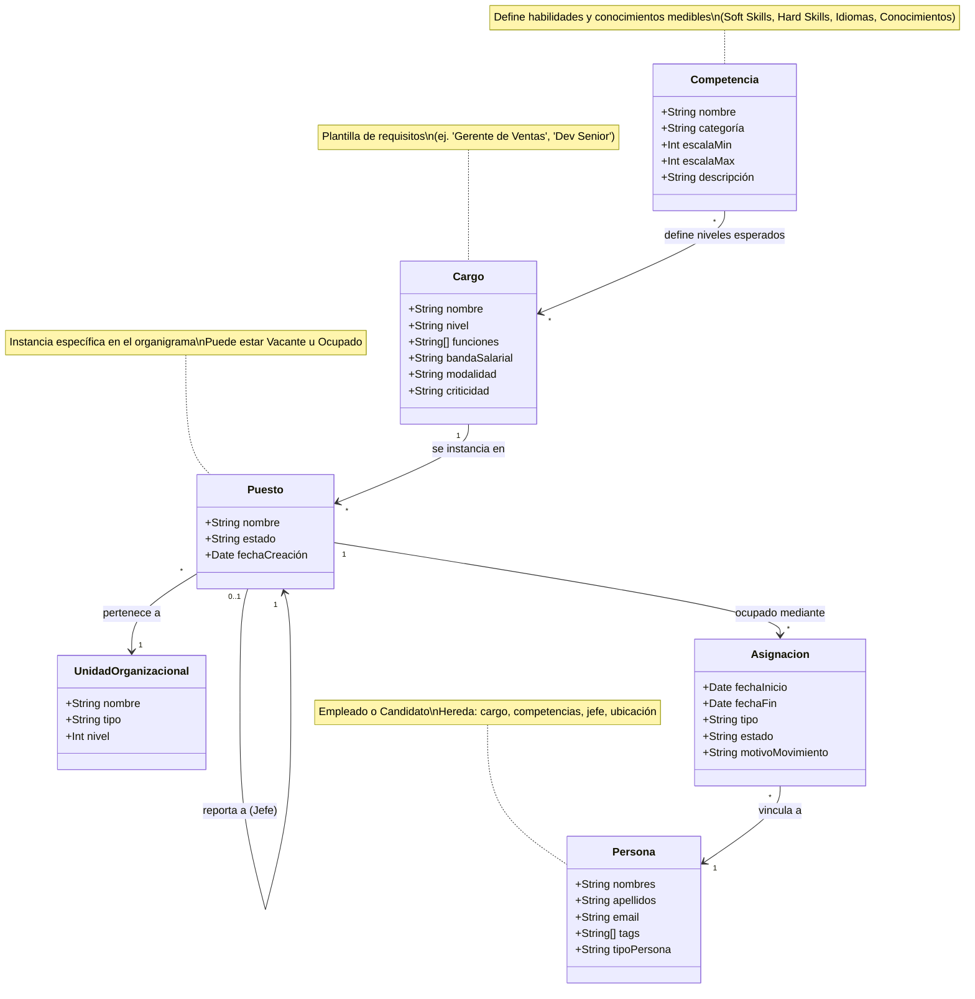

**Documento de Especificación de Requisitos de Software (SRS)**
===============================================================

**Proyecto:** Sistema SaaS de Gestión de Desempeño y Evaluación de Talento

**Versión:** 1.0

**Plataforma:** Web (SaaS Multi-tenant)**Fecha de Última Revisión:** 22 de enero de 2026

**1\. INTRODUCCIÓN Y VISIÓN DEL PRODUCTO**
------------------------------------------

### **1.1 Propósito**

El propósito de este proyecto es desarrollar una plataforma web robusta bajo el modelo _Software as a Service_ (SaaS) que permita a múltiples organizaciones (_Tenants_) gestionar integralmente sus cargos, competencias y evaluaciones de personal. El sistema facilitará la toma de decisiones estratégicas sobre el capital humano mediante la medición objetiva del desempeño, la detección de brechas de competencias y la optimización de los procesos de selección y desarrollo. Todo ello estará apoyado por herramientas colaborativas y asistencia de Inteligencia Artificial (IA).

### **1.2 Alcance del Producto**

El sistema abarcará desde la configuración administrativa inicial de cada entidad cliente, pasando por la gestión de su estructura organizacional (cargos y competencias), hasta el diseño, ejecución y análisis de evaluaciones de desempeño y selección. Incluirá un módulo de superadministración para la gestión comercial y técnica de los clientes, garantizando un entorno seguro y aislado para cada uno.

#### **Incluye:**

*   Configuración y gestión multi-tenant.
    
*   Administración organizacional (cargos, competencias, usuarios).
    
*   Motor flexible para la creación de evaluaciones (_assessments_).
    
*   Ejecución de pruebas por parte de empleados y candidatos.
    
*   Módulo avanzado de calificación con soporte manual, automático y asistido por IA.
    
*   Paneles analíticos para la toma de decisiones basada en datos.
    
*   Panel de control para el superadministrador de la plataforma.
     

**2\. DESCRIPCIÓN GENERAL, ACTORES Y MODELO DE NEGOCIO**
--------------------------------------------------------

### **2.1 Modelo de Negocio**

La plataforma opera bajo un modelo SaaS de multi-tenencia. Un único _Superadministrador_ (propietario del software) comercializa y gestiona el acceso al servicio para múltiples _Entidades_ (clientes). Cada entidad opera en un entorno de datos completamente aislado y configurable, accediendo a las funcionalidades según su plan de suscripción.

### **2.2 Roles de Usuario y Permisos**

#### **A. Nivel Plataforma (SaaS)**

1.  **Superadministrador (Owner):**
    
    *   **Responsabilidad:** Propietario y administrador global de la plataforma SaaS.
        
    *   **Funciones Clave:** Gestión del ciclo de vida de los clientes (altas, bajas, suspensiones), configuración de planes de suscripción y sus límites (_quotas_), y monitoreo del uso y salud general del sistema.
        

#### **B. Nivel Entidad (Cliente)**

1.  **Administrador de Entidad:**
    
    *   **Responsabilidad:** Usuario principal con control total sobre la configuración de su organización dentro de la plataforma.
        
    *   **Funciones Clave:** Configuración del perfil corporativo, gestión de usuarios y roles (RBAC), definición de la estructura organizacional (cargos, competencias) y supervisión general de todos los procesos.
        
2.  **Gestor de Evaluaciones (RRHH/Líder):**
    
    *   **Responsabilidad:** Diseñar, configurar y administrar los procesos de evaluación.
        
    *   **Funciones Clave:** Creación de evaluaciones utilizando el _Assessment Engine_, diseño de procesos (campañas de evaluación, selección), y asignación de participantes y evaluadores.
        
3.  **Evaluador:**
    
    *   **Responsabilidad:** Calificar respuestas y proporcionar _feedback_.
        
    *   **Funciones Clave:** Revisión y calificación de respuestas de los evaluados, utilizando herramientas de _feedback_ y asistencia de IA. Puede ser un usuario interno (ej., manager) o externo.
        
4.  **Evaluado (Empleado/Candidato):**
    
    *   **Responsabilidad:** Completar las evaluaciones asignadas.
        
    *   **Funciones Clave:** Acceso a un portal dedicado para responder pruebas de diversos tipos (selección múltiple, texto, video, archivos) dentro de los plazos establecidos. Puede visualizar sus resultados una vez que son publicados por el administrador.
        

**3\. REQUERIMIENTOS FUNCIONALES DETALLADOS**
---------------------------------------------

### **3.1 Módulo de Superadministración**

*   **RF-SA-001: Gestión de Tenants (Entidades Cliente):** Capacidad para crear, editar, suspender y eliminar entidades clientes, asignando un subdominio o identificador único.
    
*   **RF-SA-002: Gestión de Planes y Límites (Quotas):** El sistema debe permitir configurar y asignar límites por entidad para:
    
    *   Número máximo de usuarios activos.
        
    *   Cantidad de evaluaciones que pueden realizarse por ciclo (ej., mensual).
        
    *   Espacio de almacenamiento disponible para archivos multimedia (videos, documentos).
        
    *   Activación/desactivación de funcionalidades premium (ej., Calificación Asistida por IA).
        
*   **RF-SA-003: Dashboard Global:** Panel de control que visualice métricas agregadas de uso de la plataforma (usuarios activos, evaluaciones ejecutadas, consumo de almacenamiento) y el estado de las suscripciones de todos los clientes.
    

### **3.2 Módulo de Estructura Organizacional**

Este módulo define la arquitectura jerárquica de la empresa, separando la estructura (lugares) de las personas y de los perfiles funcionales.

*   **RF-ORG-001: Gestión de Unidades Organizacionales:**
    *   **Concepto de Unidad:** Representa cualquier nodo de agrupación en la empresa (ej. "Gerencia General", "Dirección de TI", "Célula Ágil A").
    *   **Estructura Jerárquica (Árbol):** Las unidades se organizan en una estructura de árbol con profundidad ilimitada.
    *   **Flexibilidad:** Permite la creación, movimiento y reestructuración de ramas completas de la organización.

*   **RF-ORG-002: Gestión de Puestos (Positions):**
    *   **Concepto de Puesto:** Es el "asiento" o lugar específico dentro de una Unidad Organizacional (ej. "Analista de Calidad - Equipo B").
    *   **Separación Persona-Puesto:** El puesto existe independientemente de quién lo ocupe. Puede estar "Vacante" u "Ocupado".
    *   **Relación Jerárquica Real:** Cada Puesto reporta a un **Puesto Supervisor** (Jefe). Esto garantiza que la jerarquía se mantenga estable aunque cambien las personas.
    *   **Vinculación al Cargo:** Cada Puesto está tipificado por un **Cargo** (RF-CONF-007), heredando sus competencias y funciones base.
    *   Cada Puesto pertenece a una única Unidad Organizacional.
    *   Una Unidad Organizacional puede contener múltiples Puestos.

#### **Diagrama: Arquitectura de Datos Organizacionales**

El siguiente diagrama ilustra la relación fundamental entre los conceptos clave del sistema:

**Flujo de Información:**
1. Las **Competencias** definen qué se debe medir (ej. "Liderazgo Nivel 5").
2. Los **Cargos** agrupan competencias requeridas en perfiles funcionales.
3. Los **Puestos** instancian cargos en ubicaciones específicas del organigrama.
4. Las **Asignaciones** vinculan personas a puestos en períodos de tiempo.
5. Las **Personas** heredan automáticamente: cargo, competencias esperadas, jefe y ubicación organizacional.

### **3.3 Módulo de Configuración de Talento**

*   **RF-CONF-004: Perfil Corporativo:** Configuración de los datos básicos de la empresa (nombre, logo, información de contacto).
    
*   **RF-CONF-005: Gestión de Usuarios y Roles (RBAC):** CRUD de usuarios y asignación granular de permisos basada en roles del sistema (Admin, Gestor, Evaluador).
    
*   **RF-CONF-006: Biblioteca de Competencias:**
    
    *   Creación y gestión de competencias (ej., "Liderazgo", "Python", "Inglés", "Normativa ISO 9001").
        
    *   **Categorización ampliada:**
        
        *   **Competencias Blandas (Soft Skills):** Habilidades interpersonales y comportamentales (ej., Liderazgo, Trabajo en Equipo, Comunicación Efectiva, Resolución de Conflictos).
            
        *   **Competencias Técnicas (Hard Skills):** Habilidades técnicas y especializadas (ej., Programación, Análisis de Datos, Diseño Gráfico, Contabilidad).
            
        *   **Idiomas:** Dominio de lenguas extranjeras (ej., Inglés, Francés, Mandarín, Alemán).
            
        *   **Conocimientos Específicos:** Conocimientos formales requeridos para el desempeño del cargo:
            
            *   _Normativas y Certificaciones:_ ISO 9001, GDPR, SOX, HACCP, Normas de Seguridad Industrial.
                
            *   _Herramientas y Software:_ SAP, Salesforce, AutoCAD, Tableau, Power BI.
                
            *   _Metodologías y Frameworks:_ Scrum, Lean, Six Sigma, ITIL, PMBOK.
                
            *   _Conocimientos de Dominio:_ Derecho Laboral, Tributación, Farmacología, Ingeniería Civil.
                
    *   Definición de una escala de medición estandarizada para cada competencia (ej., del 1 al 5).
        
*   **RF-CONF-007: Gestión de Cargos (Perfiles Funcionales):**
    
    *   Definición de **Cargos** como plantillas de requisitos (ej., "Gerente de Ventas", "Dev Senior").
        
    *   **El Cargo define:** Competencias requeridas, niveles esperados, funciones genéricas y bandas salariales. **NO define** jefe ni ubicación en el organigrama (eso es rol del Puesto).
        
    *   **Funciones del Cargo:** Detalle de responsabilidades inherentes al perfil.
        
*   **RF-CONF-007c: Clasificación Adicional de Cargos (Sugerido):**
    *   **Nivel Jerárquico:** Clasificación del cargo según su seniority (ej. "Jr", "Sr", "Liderazgo").
    *   **Modalidad y Criticidad:** Definición de esquema de trabajo y nivel de impacto en el negocio.
        
*   **RF-CONF-008: Directorio de Personal:**
    
    *   CRUD de empleados y candidatos (Legajo Virtual).
        
    *   **Asignación a Puestos:** Vinculación de la persona a uno o más **Puestos** activos (RF-ORG-002). Esto absorbe automáticamente la jerarquía y el cargo del puesto. La relación entre Personas y Puestos se gestiona mediante una entidad de Asignación, que permite múltiples asignaciones simultáneas o históricas.
        
    *   **Historial de Trayectoria (Carrera):** Registro automático basado en los cambios de Puesto.
        
        *   _Datos a persistir:_ Puesto ocupado, Unidad, Fecha Inicio/Fin, Jefe en ese momento y motivo del movimiento.
        
    *   Sistema de **Etiquetado (Tags)** flexible.
        

### **3.4 Módulo "Assessment Engine" (Motor de Evaluaciones)**

*   **RF-AE-009: Constructor de Evaluaciones:** Interfaz intuitiva de "drag & drop" o por pasos para crear exámenes o encuestas de evaluación.
    
*   **RF-AE-010: Secciones y Momentos:** Capacidad de dividir la evaluación en bloques lógicos o temporales (ej., "Sección Psicotécnica", "Entrevista Virtual", "Caso Práctico").
    
*   **RF-AE-011: Tipos de Preguntas (Arquitectura Extensible):** Soporte para tipos predefinidos y capacidad de agregar nuevos mediante "plugins":
    
    *   _Opción Múltiple (Única o Múltiple respuesta):_ Configurable con respuesta(s) correcta(s) para calificación automática opcional. 
        
    *   _Pregunta Abierta (Texto):_ Requiere calificación manual o asistida por IA.
        
    *   _Video Respuesta:_ Integración con el navegador para que el usuario grabe un video directamente en la plataforma. Se integra IA para transcribir las respuestas y analizar emociones a partir de los gestos.
        
    *   _Carga de Archivos:_ El usuario sube un documento entregable (PDF, Word, etc.).
        
    *   _Nota:_ La arquitectura debe permitir la adición futura de módulos como preguntas de código, audio, pruebas psicotécnicas complejas o cualquier otro tipo de preguntas.
        
*   **RF-AE-012: Configuración Avanzada por Pregunta:**
    
    *   Asociación obligatoria a una **Competencia** específica que mide.
        
    *   Asignación de un**Peso (Ponderación)**dentro de la evaluación total.

    *   Asignación de un **Umbral** de calificación para la pregunta.
        
    *   Configuración de "Ayuda IA": Definición de _keywords_, criterios de evaluación o una respuesta modelo para que la IA la utilice como referencia.

    *   Asignación de contenido multimedia (video, audio, imágenes) para acompañar la pregunta.

    *   Asignación de un contexto o información adicional que acompañe la pregunta (Opcional).
        
*   **RF-AE-013: Versionamiento e Inmutabilidad:**
    
    *   Una evaluación que ha sido iniciada por al menos un participante debe bloquearse contra cambios estructurales (inmutabilidad) para garantizar la consistencia de los resultados.
        
    *   Debe existir la opción de **"Clonar"** una evaluación o crear una **"Nueva Versión"** para realizar modificaciones, manteniendo el histórico.
        

### **3.5 Módulo de Procesos y Asignación**

*   **RF-PROC-014: Gestión de Procesos:** Creación de campañas o procesos de evaluación (ej., "Evaluación de Desempeño Q1 2026", "Proceso de Selección: Dev Junior").
    
*   **RF-PROC-015: Asignación de Evaluaciones a Procesos:** Vincular una o varias evaluaciones previamente creadas a un proceso específico. Los procesos pueden categorizarse (Selección, Desempeño, Clima Laboral).
    
*   **RF-PROC-016: Asignación de Participantes:** Seleccionar los empleados o candidatos que realizarán la evaluación. La asignación puede realizarse de forma individual, por Unidad Organizacional, por Cargo (a través de los Puestos activos asociados) o mediante el uso de **etiquetas (tags)**.
    
*   **RF-PROC-017: Asignación de Evaluadores y Flujo de Aprobación:** Designar los usuarios que calificarán las respuestas subjetivas de un proceso. El sistema debe soportar un flujo donde los puntajes pasen por un estado de **"Revisión"** antes de ser **"Publicados"** para el empleado, permitiendo auditorías y ajustes por parte de RRHH.
    

#### **Diagrama: Flujo de Gestión de Procesos de Evaluación**

El siguiente diagrama muestra el flujo completo desde la creación de una campaña de evaluación hasta la generación de reportes:

```mermaid
flowchart TD
    A["1. Inicio de Campaña<br/>(Proceso de Evaluación)"] --> B["2. Configuración del Proceso<br/>- Tipo: Desempeño/Selección<br/>- Evaluaciones a aplicar<br/>- Fechas y plazos"]
    
    B --> C["3. Selección de Alcance<br/>Opciones:<br/>• Personas individuales<br/>• Puestos específicos<br/>• Unidades Organizacionales<br/>• Cargos (todos los puestos)<br/>• Tags (etiquetas)"]
    
    C --> D["4. Resolución a Puestos<br/>(solo puestos activos)"]
    
    D --> E["5. Resolución a Personas<br/>(asignaciones activas)"]
    
    E --> F["6. Determinar Cargo de Referencia<br/>Persona → Puesto → Cargo"]
    
    F --> G["7. Cargar Estándares<br/>• Competencias del Cargo<br/>• Niveles Esperados<br/>• Objetivos (si aplica)"]
    
    G --> H["8. Asignación de Evaluadores<br/>• Autoevaluación<br/>• Evaluación por Jefe<br/>• Evaluación por Pares<br/>• Evaluación 360°"]
    
    H --> I["9. Ejecución de Evaluaciones<br/>(Evaluados responden)"]
    
    I --> J["10. Calificación<br/>• Automática (IA/Reglas)<br/>• Manual (Evaluadores)<br/>• Asistida por IA"]
    
    J --> K["11. Revisión y Validación<br/>Estado: 'En Revisión'<br/>RRHH audita y ajusta"]
    
    K --> L["12. Cálculo de Resultados<br/>• Desagregación por Competencia<br/>• Ponderación por pesos<br/>• Cálculo de Objetivos"]
    
    L --> M["13. Análisis de Brechas<br/>Resultado Obtenido vs<br/>Estándar del Cargo<br/>(Gap Analysis)"]
    
    M --> N["14. Publicación de Resultados<br/>Estado: 'Publicado'<br/>Visible para el evaluado"]
    
    N --> O["15. Generación de Reportes<br/>Vistas disponibles:<br/>• Por Persona (Individual)<br/>• Por Puesto<br/>• Por Cargo (Agregado)<br/>• Por Unidad Organizacional<br/>• Por Competencia<br/>• Histórico y Evolución"]
    
    style A fill:#e1f5ff
    style G fill:#fff4e1
    style K fill:#ffe1e1
    style M fill:#fff4e1
    style N fill:#e1ffe1
    style O fill:#f0e1ff
```

**Notas Clave del Flujo:**
- El **Cargo** actúa como referencia para determinar los estándares de competencias esperados.
- El sistema permite múltiples tipos de evaluadores (360°, jefe, pares, auto).
- Existe un estado intermedio de **"Revisión"** antes de publicar resultados.
- Los reportes pueden agregarse en múltiples dimensiones (persona, puesto, cargo, unidad).
- El análisis de brechas es automático al comparar resultados vs. estándares del cargo.

### **3.6 Módulo de Ejecución y Calificación (Grading)**

*   **RF-GRD-018: Calificación Automática:** Para preguntas objetivas (selección múltiple), el sistema asigna el puntaje definido automáticamente. Esta característica debe ser configurable a nivel de pregunta: el creador puede decidir si la calificación es automática o si solo se sugiere un valor para validación manual.
    
*   **RF-GRD-019: Calificación Manual Colaborativa:**
    
    *   Múltiples evaluadores pueden calificar una misma respuesta (ej., para reducir sesgos).
        
    *   Cada evaluador debe tener un campo para dejar _feedback_ o comentarios por pregunta.
        
*   **RF-GRD-020: Asistencia por Inteligencia Artificial (IA - Copiloto):**
    
    *   Para preguntas abiertas (texto, video), la IA analizará la respuesta contra los parámetros configurados (_keywords_, modelo ideal).
        
    *   La IA generará una **sugerencia de calificación** y una **justificación** basada en su análisis.
        
    *   El evaluador humano **visualizará claramente la sugerencia de la IA** y tendrá la opción de: **A) Aceptarla, B) Ajustarla, o C) Ignorarla por completo.** La IA actúa como guía, no como juez final.
        
*   **RF-GRD-021: Ponderación y Cálculo de Resultados:** Cálculo automático de la nota final del participante, aplicando los pesos configurados para cada sección y pregunta. El sistema debe **desagregar los puntajes por competencia**, no solo mostrar un promedio general.
    

### **3.7 Módulo de Resultados y Analítica**

*   **RF-RES-022: Control de Visibilidad (Release):** Los resultados de una evaluación **no son visibles** para el empleado/candidato hasta que un administrador o gestor autorizado cambie el estado del proceso a **"Publicado"**.
    
*   **RF-RES-023: Análisis de Brechas (Gap Analysis):**
    
    *   Visualización comparativa clara: **Nivel de Competencia Obtenido** (basado en la evaluación) vs. **Nivel de Competencia Requerido** (definido en el perfil del cargo del empleado o del cargo objetivo).
        
*   **RF-RES-024: Semáforos y Umbrales Configurables:** Indicadores visuales automáticos (ej., Rojo/Ambar/Verde) basados en rangos de puntuación definidos por la empresa (ej., Rojo < 60%, Verde > 90%). Facilitan la identificación rápida de áreas críticas para decisiones de contratar, capacitar o promover.
    
*   **RF-RES-025: Historial Consolidado:** Registro histórico y unificado de todas las evaluaciones en las que ha participado un empleado/candidato, permitiendo ver la evolución en el tiempo.
    

### **3.8 Módulo de Gestión de Objetivos y Evidencias (Nuevo)**

Este módulo introduce un nuevo paradigma de evaluación basado en resultados, complementario a la evaluación por competencias.

*   **RF-OBJ-027: Gestión de Objetivos (OKR/KPI):**
    
    *   **Creación y Asignación:** Capacidad para que el empleado o sus superiores definan objetivos claros a alcanzar en ventanas de tiempo específicas (Q1, Semestral, Anual).
        
    *   **Seguimiento de Avance:** 
        
        *   _Autoevaluación:_ El empleado puede actualizar el porcentaje de avance (0-100%) en cualquier momento.
            
        *   _Validación:_ El superior/líder revisa y asigna un "Porcentaje Validado" para contrastar la percepción del empleado con la realidad observada.
            
*   **RF-OBJ-028: Gestión de Evidencias de Avance:**
    
    *   Permite al empleado sustentar su progreso mediante la carga de archivos multimedia (documentos, imágenes, presentaciones) asociados a un objetivo específico.
        
    *   **Bitácora de Avances:** Interfaz tipo "Diario" donde el usuario describe la dinámica de trabajo y los logros del periodo.
        
*   **RF-OBJ-029: Soporte de Voz y Video con Transcripción (IA):**
    
    *   Funcionalidad para que el usuario grabe testimonios de avance en audio o video directamente en la plataforma.
        
    *   **Transcripción Automática (Speech-to-Text):** El sistema procesará automáticamente el audio para generar un texto plano del testimonio, facilitando la revisión y búsqueda futura por parte de los supervisores sin necesidad de reproducir todo el archivo.
        
*   **RF-OBJ-030: Reportes y Calificación por Objetivos:**
    
    *   Generación de reportes de desempeño basados en el cumplimiento de objetivos (Promedio de cumplimiento % vs. Tiempo).
    *   Integración futura con planes de trabajo y mejora.
    

### **3.9 Módulo de Desarrollo y Capacitación (Fase Futura)**
    
Este módulo utiliza los resultados del Análisis de Brechas (Gap Analysis) y del seguimiento de Objetivos para cerrar las brechas de talento identificadas en la organización.

*   **RF-CAP-032: Identificación Automática de Necesidades de Capacitación:** El sistema debe agrupar a los colaboradores que presenten brechas similares en competencias críticas para sugerir cohortes de capacitación.

*   **RF-CAP-033: Planes de Desarrollo Individual (PDI) Sugeridos por IA:** Basado en los resultados de las evaluaciones y el cargo objetivo del colaborador, la IA generará una propuesta de ruta de aprendizaje (cursos, mentorías, lecturas).

*   **RF-CAP-034: Chat Mentor IA para el Colaborador:** Interfaz de chat donde el colaborador puede consultar sobre sus brechas, pedir recomendaciones personalizadas y elaborar un plan de mejora interactuando con un modelo de IA entrenado en el catálogo de competencias de la empresa.

*   **RF-CAP-035: Gestión de Catálogo de Recursos:** Administración de una biblioteca de recursos (cursos internos, enlaces a plataformas externas, certificaciones) vinculados a las competencias de la biblioteca global.

*   **RF-CAP-036: Seguimiento de Impacto:** Correlación entre la finalización de planes de capacitación y la mejora en los puntajes de las evaluaciones de desempeño subsiguientes.

### **3.10 Notificaciones (Arquitectura Preparada para Fase Futura)**

*   **RF-NOT-037: Motor de Eventos (Event-driven):**
    *   El sistema debe generar y exponer eventos internos (_triggers_) estandarizados cuando ocurren acciones clave (ej., "Evaluación Asignada", "Evaluación Completada por Participante", "Calificación Pendiente por Revisar"). Esta arquitectura permitirá la futura integración con sistemas de notificación por email, push en la app, o conectores con Slack/MS Teams.

**4\. LÓGICA DE NEGOCIO CRÍTICA: RELACIÓN EVALUACIÓN-COMPETENCIA-CARGO Y EL ANÁLISIS DE BRECHAS**
------------------------------------------------------------------------------------------------

Para garantizar que el sistema genere información estratégica y accionable —más allá de la mera emisión de calificaciones—, se establece una lógica de negocio integral y obligatoria. Esta lógica asegura que cada evaluación esté directamente alineada con los estándares de desempeño de la organización y permita una medición objetiva del talento.

**4.1 Flujo Conceptual de la Medición del Desempeño**
-----------------------------------------------------

1.  **Definición del Estándar de Desempeño (Nivel Cargo):** En el módulo de configuración organizacional, cada **Perfil de Cargo** establece el marco de competencias requeridas para un desempeño óptimo. Para cada competencia relevante (ej., "Negociación", "Liderazgo"), se define un **Nivel Esperado** o **Nivel de Dominio Requerido** (ej., "Nivel 5 en una escala de 1 a 5"). Este perfil constituye el modelo o estándar contra el cual se medirá el desempeño individual.
    
2.  **Diseño del Instrumento de Medición (Nivel Evaluación):** En el motor de evaluaciones (_Assessment Engine_), cada **Pregunta** creada debe asociarse obligatoriamente a una **Competencia** específica que pretende medir. Así, una evaluación se compone de un conjunto de preguntas que, en conjunto, forman un instrumento de medición válido y alineado con las competencias críticas para el negocio.
    
3.  **Contextualización y Aplicación (Nivel Proceso):** Los **Procesos de Evaluación** (ej., "Evaluación de Desempeño Semestral", "Proceso de Selección para Gerente") actúan como el contexto operativo que vincula:
    
    *   **El instrumento:** Una o más evaluaciones específicas.
        
    *   **El sujeto:** Empleados (asociados a su puesto activo principal, del cual se deriva el cargo) o candidatos (asociados a un cargo objetivo).
        
    *   **Los evaluadores:** Usuarios designados para calificar.
        
4.  **Proceso de Calificación y Desagregación por Competencia:** Durante la calificación, el sistema trasciende el cálculo de un promedio general. Ejecuta una **desagregación inteligente** de los puntajes:
    
    *   Agrupa y consolida los resultados de todas las preguntas asociadas a una misma competencia.
        
    *   Calcula un **Nivel de Competencia Obtenido** para cada una, reflejando el desempeño demostrado en la evaluación.
        
    *   _Resultado:_ "El/la colaborador(a) alcanzó un **Nivel 4.0** en la competencia 'Negociación'."
        
5.  **Análisis Automático de Brechas (Gap Analysis) y Generación de Insights:** En el módulo de analítica, el sistema **cruza automáticamente** los resultados obtenidos con los estándares definidos en el perfil de cargo correspondiente. Este cruce genera el valor central del sistema:
    
    *   **Nivel Esperado (del Cargo):** 5.0
        
    *   **Nivel Obtenido (en la Evaluación):** 4.0
        
        
    *   **Brecha de Competencia Identificada:** -1.0Esta brecha cuantificada y desglosada por competencia se convierte en el insumo fundamental para los reportes de talento, sustentando de manera objetiva decisiones estratégicas de **capacitación, planes de desarrollo, promociones o acciones de reclutamiento**.

**4.2 Modelo Dual de Evaluación (Versatilidad)**
------------------------------------------------

El sistema evoluciona hacia una plataforma integral que permite medir el desempeño desde dos dimensiones complementarias:

1.  **Evaluación por Competencias (El "CÓMO"):** Mide comportamientos, habilidades y conocimientos (Hard & Soft Skills) necesarios para el cargo.
    
2.  **Evaluación por Objetivos (El "QUÉ"):** Mide resultados tangibles y el cumplimiento de metas específicas definidas en el módulo de Objetivos.

*   _Impacto en Reportes:_ Las evaluaciones de desempeño finales pueden configurarse para ponderar ambos factores (ej., 60% Objetivos, 40% Competencias), ofreciendo una visión holística del empleado.
        

**4.3 Valor Generado: De la Calificación a la Decisión**
--------------------------------------------------------

Esta arquitectura garantiza que la plataforma no sea un simple administrador de pruebas, sino un sistema de gestión del talento basado en evidencia. La relación tripartita **Cargo → Evaluación (vía Competencias) → Proceso**, sumada a la nueva dimensión de **Objetivos**, permite transformar datos crudos en **insights accionables**.

Al integrar la medición de objetivos, el sistema permite correlacionar el **desarrollo de habilidades (Competencias/INPUT)** con los **resultados tangibles del negocio (Objetivos/OUTPUT)**. Esto facilita identificar escenarios complejos, como empleados que tienen las competencias pero fallan en la ejecución (problema conductual/motivacional) o aquellos que cumplen sus objetivos pero carecen de las bases técnicas sostenibles (alto riesgo a largo plazo). Esta visión 360° guía intervenciones de liderazgo y planes de carrera mucho más precisos.

**5\. REQUERIMIENTOS NO FUNCIONALES (TÉCNICOS Y DE CALIDAD)**
-------------------------------------------------------------

*   **RNF-001: Escalabilidad y Aislamiento Multi-tenant:** La arquitectura de base de datos y aplicación debe garantizar un aislamiento lógico absoluto de los datos entre diferentes clientes (entidades). Un tenant no debe poder acceder, ni siquiera incidentalmente, a datos de otro.
    
*   **RNF-002: Extensibilidad y Mantenibilidad:** El backend debe utilizar patrones de diseño (como Strategy, Factory, Plugin) que permitan agregar nuevos **tipos de pregunta** o **proveedores de IA** sin necesidad de modificar el núcleo (_core_) del sistema. Cambios mediante adición, no modificación.
    
*   **RNF-003: Almacenamiento Multimedia Eficiente:** Integración con servicios de almacenamiento de objetos en la nube (ej., AWS S3, Google Cloud Storage) para el manejo seguro, escalable y eficiente en costos de videos y documentos pesados.
    
*   **RNF-004: Seguridad:**
    
    *   Todos los datos sensibles (credenciales, información personal) deben almacenarse encriptados.
        
    *   Uso obligatorio de HTTPS (TLS) para todo el tráfico.
        
    *   Protección contra vulnerabilidades web comunes (OWASP Top 10).
        
*   **RNF-005: Experiencia de Usuario (UX/UI):**
    
    *   Diseño web **100% Responsive**, que ofrezca una experiencia optimizada en dispositivos de escritorio, tabletas y móviles.
        
    *   Interfaz intuitiva y enfocada en la usabilidad, considerando que los usuarios pueden tener perfiles no técnicos (ej., gerentes, empleados).
        
    *   Tiempos de carga reducidos y _feedback_ visual claro durante las interacciones.
        

**6\. ARQUITECTURA Y ESPECIFICACIONES TÉCNICAS CLAVE**
------------------------------------------------------

### **6.1 Stack Tecnológico Principal (Core Stack)**

*   **Backend (API & Lógica de Negocio):**
    
    *   **Framework:** NestJS. Seleccionado por su arquitectura modular basada en módulos e inyección de dependencias, ideal para aplicaciones escalables y mantenibles.
        
    *   **ORM:** Prisma. Proporciona un cliente de base de datos _type-safe_, facilitando las migraciones, la integridad referencial y reduciendo errores en tiempo de desarrollo.
        
    *   **Base de Datos Principal:** PostgreSQL. Base de datos relacional robusta y adecuada para manejar el modelo de datos complejo, transaccional y con múltiples relaciones del sistema.

    *   **Servicios Cogntivos/IA:** Integración con proveedores (ej. OpenAI Whisper, Google Speech-to-Text) para los servicios de transcripción automática de audio/video en el módulo de objetivos.
        
*   **Frontend (Aplicación Web):**
    
    *   **Librería y Bundler:** React con Vite. Ofrece un ecosistema maduro y un entorno de desarrollo extremadamente rápido.
        
    *   **Gestión de Estado Global:** Zustand. Se prefiere por su simplicidad, rendimiento y baja verbosidad en comparación con Redux, adecuado para manejar el estado de la sesión del usuario, el rol activo y datos de la UI.
        
    *   **Estilizado y Componentes:** Tailwind CSS combinado con DaisyUI. Permite un desarrollo UI rápido y consistente mediante utilidades, con un conjunto de componentes accesibles y profesionales listos para usar.
        

### **6.2 Estrategia de División del Frontend**

Para optimizar el desarrollo y el mantenimiento, se utilizarán dos repositorios diferentes divididos por layouts y contextos.

1.  **Aplicación de Superadministrador (SaaS Owner):**
    
    *   Aplicación o módulo aislado con su propio _routing_ y layout.
        
    *   **Contenido:** Exclusivamente las funcionalidades para gestionar tenants, planes, y el dashboard global.
        
2.  **Aplicación del Tenant (Portal Corporativo Único):**
    
    *   Una sola aplicación React que adapta su interfaz dinámicamente según el **Contexto de Sesión** del usuario.
        
    *   **Módulos Internos Contextuales:**
        
        *   **Módulo de Gestión (Admin/RRHH):** Vistas para configurar la organización, cargos, competencias y diseñar evaluaciones.
            
        *   **Módulo de Calificación (Evaluador):** Interfaz optimizada para revisar y calificar respuestas, con integración de la herramienta de IA y _feedback_.
            
        *   **Módulo de Ejecución (Evaluado):** Portal limpio y enfocado para que los empleados/candidatos respondan sus evaluaciones, con soporte para grabación de video y carga de archivos.
            

### **6.3 Gestión de Roles Múltiples y "Role Switcher"**

Para usuarios con múltiples roles (ej., un Gerente que es _Evaluador_ de su equipo y _Evaluado_ en su propia evaluación), se implementará un sistema de **"Contexto Activo" (Active Role)**.

*   **Lógica de Implementación:**
    
    1.  Al iniciar sesión, el backend retorna la lista de roles del usuario.
        
    2.  Se almacena en el estado global (Zustand) el **activeRole** seleccionado por el usuario (por defecto, su rol principal o el último usado).
        
    3.  **El layout, la navegación (sidebar) y las rutas accesibles se adaptan en tiempo real** basándose en el activeRole.
        
    4.  Un selector en el encabezado permite al usuario cambiar entre sus roles disponibles de forma rápida y segura.
        
*   **Seguridad:** Cada petición al backend incluye el activeRole. NestJS validará en el _guard_ correspondiente que el usuario tenga efectivamente asignado ese rol, previniendo la escalada de privilegios.
    
**7. CONTEXTO DEL REPOSITORIO ACTUAL**
------------------------------------------------------

Este directorio y repositorio actual corresponden específicamente al proyecto del **Portal del Cliente (Tenant)**, el cual centraliza las funcionalidades de administración corporativa, evaluación y ejecución de exámenes para los usuarios finales, integrando los módulos de Gestión, Calificación y Ejecución bajo una misma arquitectura frontend.
