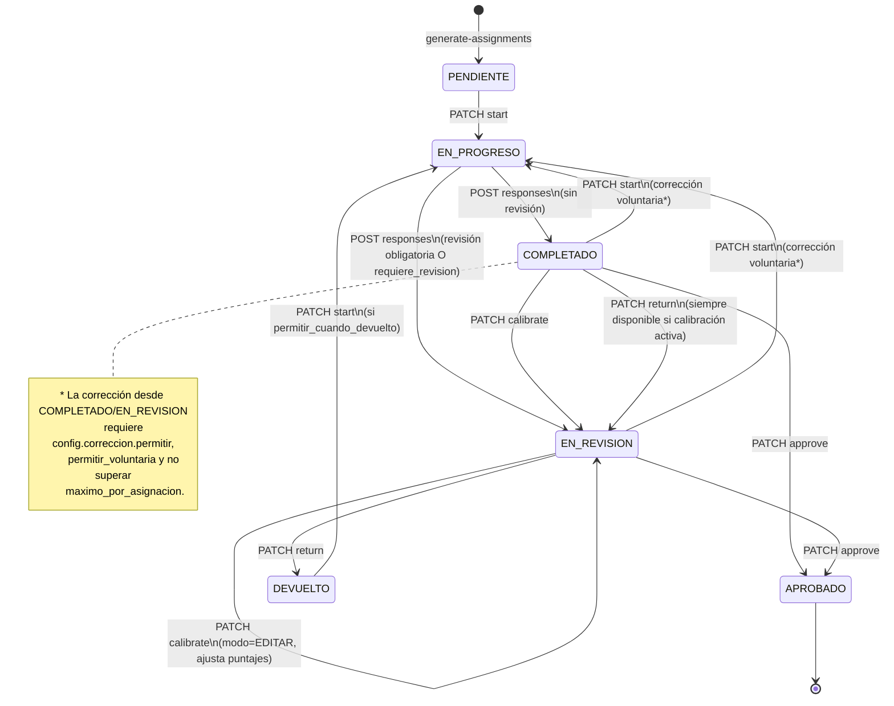

# Documentación de la API: Evaluaciones de Competencias

Esta documentación detalla de forma integral los endpoints disponibles para la gestión y configuración de procesos de evaluación de competencias, diseñado para el rol de **Gestor de Recursos Humanos**, evaluadores y RRHH (calibración). El módulo está organizado de forma modular para soportar las 4 pestañas de configuración del frontend, la ejecución de evaluaciones, la calibración por RRHH y el análisis de resultados/brechas.

**Índice:**
1. [Generalidades](#1-generalidades)
2. [Flujo del módulo y estados](#2-flujo-del-módulo-y-estados)
3. [Catálogos y Parámetros del Sistema](#3-catálogos-y-parámetros-del-sistema)
4. [Gestión General de Procesos (CRUD y Métricas)](#4-gestión-general-de-procesos-crud-y-métricas)
5. [Pestaña 1: Información General (GeneralTab)](#5-pestaña-1-información-general-generaltab)
6. [Pestaña 2: Competencias (CompetenciesTab)](#6-pestaña-2-competencias-competenciestab)
7. [Pestaña 3: Participantes (ParticipantsTab)](#7-pestaña-3-participantes-participantstab)
8. [Pestaña 4: Correos (EmailConfigTab)](#8-pestaña-4-correos-emailconfigtab)
9. [Asignaciones, Respuestas y Calibración](#9-asignaciones-respuestas-y-calibración)
10. [Resultados y Análisis de Brechas](#10-resultados-y-análisis-de-brechas)

---

## 1. Generalidades

- **Base URL:** `/competency-evaluations`.
- **Autenticación:** Requiere Token Bearer en el header HTTP (`Authorization: Bearer <token>`).
- **Formato de Respuesta Estándar:**
  Todas las respuestas exitosas y de error están estandarizadas a través del interceptor global:
  ```json
  {
    "success": true,
    "message": "Mensaje descriptivo de la operación",
    "data": T | null
  }
  ```
- **Paginación Estándar:** Los endpoints de listado paginado retornan la estructura:
  ```json
  {
    "datos": [ ... ],
    "paginacion": {
      "total": 50,
      "pagina": 1,
      "limite": 20,
      "total_paginas": 3
    }
  }
  ```
  Query params de paginación (heredados de `PaginationDto`): `pagina` (default `1`), `limite` (default `20`, max `100`).

---

## 2. Flujo del módulo y estados

Esta sección describe el ciclo de vida completo del módulo: desde la creación del proceso, la configuración en sus 4 pestañas, la generación de asignaciones, la ejecución por los evaluadores, la revisión/calibración por RRHH y la obtención de resultados.

### 2.1 Diagrama general del flujo (Mermaid)

```mermaid
flowchart TD
    A["POST /competency-evaluations<br/>Proceso creado en BORRADOR"] --> B["Configuración en 4 pestañas<br/>§5 Config · §6 Competencias<br/>§7 Participantes · §8 Correos"]

    B --> C["PATCH /:id/estado → PUBLICADO"]
    C --> D["POST /:id/generate-assignments<br/>★ SE CREAN LAS ASIGNACIONES<br/>estado inicial: PENDIENTE"]

    D --> E{"PATCH /assignments/:id/start"}
    E --> F["EN_PROGRESO"]

    F --> G["POST /responses<br/>Upsert 1 respuesta por asignación"]
    G --> H{"revision_obligatoria O<br/>correccion.requiere_revision?"}

    H -->|Sí| I["EN_REVISION<br/>(asignación y respuesta)"]
    H -->|No| J["COMPLETADO<br/>(asignación y respuesta)"]

    I --> K{"Acciones RRHH<br/>(requieren calibracion_rrhh.activo)"}
    J --> K

    K -->|PATCH .../approve| L["APROBADO"]
    K -->|PATCH .../calibrate<br/>(modo=EDITAR)| I
    K -->|PATCH .../return<br/>(permitir_cuando_devuelto)| M["DEVUELTO"]

    M -->|"start + responses<br/>(si política de corrección lo permite)"| F

    E -.->|"viene de COMPLETADO/EN_REVISION<br/>= corrección (incrementa contador)"| F

    L --> N["GET .../competency-levels<br/>Niveles consolidados + brechas<br/>solo cuenta APROBADO y COMPLETADO"]

    style A fill:#e1f5ff
    style D fill:#fff4e1
    style G fill:#fff4e1
    style I fill:#ffe1e1
    style L fill:#e1ffe1
    style M fill:#ffe1e1
    style N fill:#f0e1ff
```

### 2.2 Estados del Proceso (`ESTADO_PROCESO_EVALUACION`)

#### Catálogo

| Código | Significado | Quién lo usa / Cuándo |
|---|---|---|
| `BORRADOR` | Proceso en configuración inicial. | Estado por defecto al crear (`POST`). Las clonaciones siempre nacen aquí. |
| `PUBLICADO` | Proceso publicado, visible para participantes. | RRHH publica cuando la configuración está lista. **Auto-genera asignaciones si no existen**. |
| `EN_CALIFICACION` | Fase de calificación: evaluadores responden. | Fase operativa activa. |
| `EN_REVISION` | Evaluaciones completadas, en cola de revisión/calibración por RRHH. | Fase de auditoría de puntajes. |
| `CERRADO` | Proceso finalizado y resultados publicados. | Cierre del ciclo. |
| `ARCHIVADO` | Proceso archivado históricamente. | Retiro del listado activo sin eliminar. |

#### Máquina de transiciones (estricta)

El endpoint `PATCH /:id/estado` **valida la secuencia** según la siguiente tabla. Transiciones no permitidas devuelven `400 BadRequest`.

| Estado actual | Destinos permitidos |
|---|---|
| `BORRADOR` | `PUBLICADO`, `ARCHIVADO` |
| `PUBLICADO` | `EN_CALIFICACION`, `ARCHIVADO` |
| `EN_CALIFICACION` | `EN_REVISION`, `ARCHIVADO` |
| `EN_REVISION` | `EN_CALIFICACION`, `CERRADO`, `ARCHIVADO` |
| `CERRADO` | `ARCHIVADO` |
| `ARCHIVADO` | *(terminal, sin salidas)* |

> **Nota:** `PUBLICADO → BORRADOR` **no está permitido** (des-publicar). Para reabrir configuración se usa `EN_REVISION → EN_CALIFICACION`.

#### Transiciones y endpoints

| Desde | Hacia | Endpoint | Notas |
|---|---|---|---|
| — | `BORRADOR` (o `PUBLICADO`/`ARCHIVADO`) | `POST /competency-evaluations` | El DTO de creación solo acepta `BORRADOR \| PUBLICADO \| ARCHIVADO`. Default: `BORRADOR`. |
| según máquina | según máquina | `PATCH /:id/estado` (o `/status`) | Body `{ "estado_flujo": "..." }`. **Valida transición según la máquina de estados**. Al llegar a `PUBLICADO`, si no hay asignaciones, **se auto-generan** (ver §2.5). |
| cualquiera | `BORRADOR` | `POST /:id/clone` | El clon siempre nace en `BORRADOR`. |
| cualquiera | *(soft delete)* | `DELETE /:id` | Marca `eliminado=1`; no cambia el estado. Bloqueado si hay respuestas activas (ver §4.9). |

> **Nota:** `GET /colaborador/:colaboradorId` solo considera procesos en `PUBLICADO`, `EN_CALIFICACION` o `EN_REVISION` (ver §4.4).

### 2.3 Estados de la Asignación (`ESTADO_ASIGNACION_EVALUACION`)

Una **asignación** representa el vínculo (evaluador ↔ colaborador ↔ proceso) y es la unidad de trabajo del evaluador. Cada asignación puede tener **como máximo una respuesta** (upsert por `asignacion_id`).

#### Catálogo

| Código | Significado | Cómo se llega |
|---|---|---|
| `PENDIENTE` | Asignación creada, aún no iniciada por el evaluador. | Estado inicial en `POST /:id/generate-assignments`. |
| `EN_PROGRESO` | El evaluador abrió/inició la evaluación. | `PATCH /assignments/:id/start` desde `PENDIENTE`, o desde `COMPLETADO`/`EN_REVISION`/`DEVUELTO` vía corrección. |
| `COMPLETADO` | Respuesta enviada, sin pasar por revisión obligatoria. | `POST /responses` cuando `revision_obligatoria=false` y `correccion.requiere_revision=false`. |
| `EN_REVISION` | Respuesta enviada, en cola de revisión/calibración RRHH. | `POST /responses` cuando `revision_obligatoria=true` **o** `correccion.requiere_revision=true`; o vía `PATCH .../calibrate`. |
| `APROBADO` | Aprobada formalmente por RRHH (resultado definitivo). | `PATCH .../approve`. |
| `DEVUELTO` | Devuelta al evaluador para correcciones. | `PATCH .../return` (requiere `correccion.permitir_cuando_devuelto=true`). |

#### Máquina de transiciones (con endpoints)



#### Tabla de transiciones (misma información en tabla)

| Desde | Hacia | Endpoint | Disparador / Precondiciones |
|---|---|---|---|
| — | `PENDIENTE` | `POST /:id/generate-assignments` | Creación masiva. **Soft-deleta todas las asignaciones previas del proceso** y las regenera. |
| `PENDIENTE` | `EN_PROGRESO` | `PATCH /assignments/:id/start` | Evaluador abre la evaluación. Sin restricciones de corrección. |
| `EN_PROGRESO` | `COMPLETADO` | `POST /responses` | `revision_obligatoria=false` **y** `correccion.requiere_revision=false`. |
| `EN_PROGRESO` | `EN_REVISION` | `POST /responses` | `revision_obligatoria=true` **o** `correccion.requiere_revision=true` (default del sistema: ambos `true`). |
| `PENDIENTE`, `DEVUELTO`, `COMPLETADO`, `EN_REVISION` | (`EN_PROGRESO` vía reenvío) | `POST /responses` | También se permite guardar respuesta directamente desde estos estados (upsert). Estados origen válidos: `PENDIENTE \| EN_PROGRESO \| DEVUELTO \| COMPLETADO \| EN_REVISION`. **`APROBADO` rechaza.** |
| `COMPLETADO`, `EN_REVISION` | `EN_PROGRESO` | `PATCH /assignments/:id/start` | **Corrección:** requiere `correccion.permitir=true`, no superar `maximo_por_asignacion` (si no es `null`); incrementa `contador_correcciones`. |
| `COMPLETADO`, `EN_REVISION` | `APROBADO` | `PATCH /assignments/:id/approve` | Requiere `calibracion_rrhh.activo=true`. Si existe respuesta, aplica `competencias_calibradas` sobre ella. |
| `EN_REVISION` (o `COMPLETADO`) | `EN_REVISION` | `PATCH /assignments/:id/calibrate` | Requiere `calibracion_rrhh.activo=true` **y** `calibracion_rrhh.modo=EDITAR`. Reescribe puntajes de la respuesta. |
| `EN_REVISION` (o `COMPLETADO`) | `DEVUELTO` | `PATCH /assignments/:id/return` | Requiere `calibracion_rrhh.activo=true` **y** `correccion.permitir_cuando_devuelto=true`. |
| `DEVUELTO` | `EN_PROGRESO` | `PATCH /assignments/:id/start` | Corrección tras devolución (política `permitir_cuando_devuelto` ya validada al devolver; `start` revalida `permitir` y el máximo). |
| cualquier | *(soft delete)* | `PATCH /:id/participants` con `retirar` | Solo si **no** tiene evaluaciones en `EN_PROGRESO/COMPLETADO/EN_REVISION/APROBADO` ni respuestas. |

#### `correccion_disponible` (flag calculado en el listado de asignaciones)

El listado `GET /assignments` incluye `correccion_disponible` calculado así:

| Estado actual | Condición para que sea `true` |
|---|---|
| `COMPLETADO` o `EN_REVISION` | `correccion.permitir=true` **y** `correccion.permitir_voluntaria=true` **y** no superó `maximo_por_asignacion`. |
| `DEVUELTO` | `correccion.permitir=true` **y** `correccion.permitir_cuando_devuelto=true` **y** no superó `maximo_por_asignacion`. |
| cualquier otro (`PENDIENTE`, `EN_PROGRESO`, `APROBADO`) | Siempre `false`. |

### 2.4 Estados de la Respuesta

La **Respuesta** (`EvaluacionCompetenciaRespuesta`) **reutiliza el mismo catálogo** `ESTADO_ASIGNACION_EVALUACION` (no existe un catálogo propio).

| Código | Cuándo ocurre |
|---|---|
| `COMPLETADO` | Se guardó con `POST /responses` y la config no exige revisión. |
| `EN_REVISION` | Se guardó con `POST /responses` con revisión obligatoria, o fue alterada por `calibrate`. |

- **Relación 1:1 con la asignación** (`upsert` por `asignacion_id`): re-enviar sobrescribe la misma fila y actualiza `fecha_ultima_edicion`.
- El estado de la respuesta **siempre se espeja** con el estado destino de la asignación en `saveResponse`.
- La respuesta **no** transita a `APROBADO`/`DEVUELTO`: esos estados son exclusivos de la asignación. Al aprobar/devolver se actualiza la asignación (y al aprobar/calibrar se reescriben los puntajes de la respuesta si existe).

### 2.5 Cuándo se crean las asignaciones

Las asignaciones se crean en dos escenarios:

> **1. Explícito:** `POST /competency-evaluations/:id/generate-assignments` (§7.4) — llamado por RRHH.
>
> **2. Automático (idempotente):** al transicionar el proceso a `PUBLICADO` vía `PATCH /:id/estado` — **solo si no existen asignaciones** (ver §4.7).

Comportamiento (transaccional, ambas vías):

1. **Soft-deleta todas las asignaciones existentes** del proceso (`eliminado=1`). Es una **regeneración total**: no hay endpoint de alta individual de asignaciones.
2. Lee la config del proceso y toma los `tipos_evaluacion` con `activo=true`.
3. Por cada **participante activo** (`eliminado=0`), resuelve evaluadores:

| Tipo | Resolución |
|---|---|
| `AUTOEVALUACION` | `usuario.id` del propio colaborador evaluado. |
| `JEFE_DIRECTO` | Usuario del colaborador que ocupa el **Puesto supervisor** (`jefe_puesto_id`) del puesto activo del evaluado. Si no hay jefe → no se crea asignación de este tipo. |
| `OTRO` | IDs manuales del mapa `evaluadores_por_colaborador_json[colaborador_id]` (configurados en §7.2/§7.3). |

4. Crea cada asignación con:
   - `estado = PENDIENTE`
   - `peso = config.tipos_evaluacion[tipo].peso` (o `100` si no se encuentra el tipo)
   - `contador_correcciones = 0`

> **Importante:**
> - La regeneración explícita (`generate-assignments`) **bloquea si hay evaluaciones en curso** (§7.4).
> - La auto-generación al publicar es **idempotente**: solo corre cuando `count(asignaciones) === 0`.
> - Si cambias participantes, evaluadores o tipos de evaluador después de haber generado, debes volver a llamar `generate-assignments` explícitamente para reflejar los cambios (las asignaciones previas se descartan).

### 2.6 Configuración que condiciona el flujo

Propiedad de `configuracion_json` del proceso (editable en §5.2). Defaults del sistema (`DEFAULT_CONFIG`):

| Propiedad | Default | Efecto en el flujo | Dónde se lee |
|---|---|---|---|
| `tipos_evaluacion[].activo` | `AUTOEVALUACION` y `JEFE_DIRECTO` activos; `OTRO` inactivo | Determina qué tipos de evaluador se generan en asignaciones. | `generate-assignments` |
| `tipos_evaluacion[].peso` | `0` | Peso de cada asignación al consolidar resultados (`competency-levels`). Si hay participantes, la suma de pesos de tipos activos debe ser 100%. | `updateConfig`, `competency-levels` |
| `revision_obligatoria` | `true` | Si `true`, `POST /responses` deja la asignación en `EN_REVISION` (si no, en `COMPLETADO`). | `saveResponse` |
| `correccion.requiere_revision` | `true` | Si `true` (junto con lo anterior, en modo OR), fuerza `EN_REVISION` al enviar. | `saveResponse` |
| `correccion.permitir` | `true` | Habilita cualquier corrección vía `start` desde `COMPLETADO`/`EN_REVISION`. | `startAssignment`, `correccion_disponible` |
| `correccion.maximo_por_asignacion` | `null` (ilimitado) | Tope de correcciones antes de rechazar `start`. | `startAssignment` |
| `correccion.permitir_voluntaria` | `false` | Si `false`, el evaluador **no** puede corregir por su cuenta estando en `COMPLETADO`/`EN_REVISION` (solo si RRHH devuelve). | `correccion_disponible` |
| `correccion.permitir_cuando_devuelto` | `true` | Habilita `PATCH .../return` y la corrección posterior desde `DEVUELTO`. | `returnAssignment`, `correccion_disponible` |
| `calibracion_rrhh.activo` | `true` | Habilita `approve` / `calibrate` / `return`. Si `false`, RRHH no puede actuar. | `executeCalibracion` |
| `calibracion_rrhh.modo` | `SOLO_REVISAR` | Si `EDITAR`, `calibrate` puede reescribir puntajes. Si `SOLO_REVISAR`, `calibrate` es rechazado. | `executeCalibracion` |

### 2.7 Vista en tablas del flujo end-to-end (alternativa al Mermaid)

Si prefieres una lectura lineal sin diagrama:

| Fase | # | Acción | Endpoint | Estado que resulta |
|---|---|---|---|---|
| **1. Creación** | 1 | Crear proceso | `POST /competency-evaluations` | Proceso `BORRADOR` |
| **2. Configuración** | 2 | Guardar políticas (tipos, pesos, calibración, corrección) | `PUT /:id/config` | — |
| | 3 | Asignar competencias (manual o desde cargos) | `PATCH /:id/competencies` | — |
| | 4 | Agregar participantes y evaluadores custom | `PATCH /:id/participants` | — |
| | 5 | Vincular plantillas de correo | `PUT /:id/emails` | — |
| **3. Publicación** | 6 | Publicar el proceso | `PATCH /:id/estado` | Proceso `PUBLICADO` |
| **4. Asignación** | 7 | Generar asignaciones de evaluadores | `POST /:id/generate-assignments` | Asignaciones `PENDIENTE` |
| **5. Ejecución** | 8 | Evaluador inicia | `PATCH /assignments/:id/start` | Asignación `EN_PROGRESO` |
| | 9 | Evaluador envía calificaciones | `POST /responses` | Asignación y Respuesta → `EN_REVISION` o `COMPLETADO` (según config) |
| **6. Corrección (opc.)** | 10 | RRHH devuelve | `PATCH /assignments/:id/return` | Asignación `DEVUELTO` |
| | 11 | Evaluador corrige y reenvía | `start` + `responses` | `EN_PROGRESO` → `EN_REVISION`/`COMPLETADO` |
| **7. Calibración RRHH** | 12 | RRHH ajusta puntajes | `PATCH /assignments/:id/calibrate` | Permanece `EN_REVISION`, respuesta actualizada |
| | 13 | RRHH aprueba | `PATCH /assignments/:id/approve` | Asignación `APROBADO` |
| **8. Cierre proceso** | 14 | Cerrar proceso | `PATCH /:id/estado` | Proceso `CERRADO` |
| **9. Resultados** | 15 | Consultar niveles y brechas | `GET /:procesoId/collaborators/:colaboradorId/competency-levels` | Consolida solo `APROBADO` + `COMPLETADO` |
| | 16 | Listar respuestas crudas | `GET /responses` | — |
| | 17 | Proceso activo de un colaborador | `GET /colaborador/:colaboradorId` | — |

### 2.8 Reglas de negocio críticas (resumen)

1. **Regeneración total de asignaciones:** `generate-assignments` siempre descarta las anteriores.
2. **Una respuesta por asignación** (upsert). No hay multi-versión de respuestas.
3. **Todas las competencias del proceso** deben venir calificadas en `POST /responses` (niveles numéricos en rango `0–5`); si falta alguna → `400`.
4. **`APROBADO` es terminal** para el evaluador: no se puede re-enviar respuesta ni iniciar corrección desde ese estado.
5. **Calibración requiere** `calibracion_rrhh.activo`; `calibrate` additionally requiere `modo=EDITAR`.
6. **Aprobar/calibrar reescriben** los puntajes de la respuesta original (si existe) con `competencias_calibradas` y recalculan `puntaje_numerico`.
7. **Toda acción de calibración** deja registro en el log (`EvaluacionCompetenciaLogCalibracion`) con puntajes originales vs. calibrados, acción y comentario.
8. **Resultados finales** (`competency-levels`) solo consideran asignaciones en `APROBADO` o `COMPLETADO`; consolidación ponderada por `peso` de la asignación; brecha contra el nivel esperado del **Cargo** del puesto activo del colaborador.
9. **Aislamiento multi-tenant:** todos los endpoints filtran por `entidad_id` del usuario (salvo superadmin).
10. **Máquina de estados del proceso:** transiciones validadas estrictamente (§2.2). `PUBLICADO → BORRADOR` bloqueado.
11. **Auto-generación idempotente al publicar:** al llegar a `PUBLICADO`, si `count(asignaciones) === 0`, se generan automáticamente.
12. **Escalas por competencia (homogeneización):** cada competencia define su propia escala (`1..escala`, con niveles rotulados tipo "Bajo/Medio/Alto" en `CompetenciaNivel`). El sistema **sí tiene en cuenta estos máximos/mínimos**:
    - Al calificar o calibrar, el nivel debe estar dentro de la escala de **su** competencia (no un rango plano 1–5).
    - El `puntaje_numerico` de la respuesta y la consolidación de §10 homogeneizan cada nivel a un relativo `0..1` (`(nivel−1)/(escala−1)`) antes de promediar/ponderar, y lo expresan de vuelta en una escala común (1–5 en la respuesta; escala del catálogo en §10).
    - El snapshot de la respuesta conserva escalas y etiquetas de nivel al momento del envío (inmutables para el historial).
13. **Inmutabilidad por datos (guards S2):**
    - `PATCH competencies`: bloqueado si hay respuestas activas o proceso en `CERRADO/ARCHIVADO`.
    - `POST generate-assignments`: bloqueado si hay asignaciones avanzadas (con respuestas o estado > `PENDIENTE`) o proceso en `CERRADO/ARCHIVADO`.
    - `PATCH participants` (`agregar`): bloqueado en `CERRADO/ARCHIVADO`; `retirar` mantiene su validación de inmutabilidad.
    - `PUT config`: bloquea cambios en `tipos_evaluacion` (activo/peso) si hay asignaciones avanzadas; flags de corrección/calibración editables siempre.
    - `DELETE /:id`: bloqueado si hay respuestas activas (sugerir `ARCHIVADO`).
    - `POST /responses`: exige proceso en `PUBLICADO/EN_CALIFICACION/EN_REVISION` (rechaza en `BORRADOR/CERRADO/ARCHIVADO`).

---

## 3. Catálogos y Parámetros del Sistema

Los estados y tipos se gestionan mediante los parámetros del sistema (`Parametro`).

### A. Estados de Proceso (`ESTADO_PROCESO_EVALUACION`)

- `BORRADOR`: Proceso en configuración inicial.
- `PUBLICADO`: Proceso listo o publicado.
- `EN_CALIFICACION`: Evaluaciones en curso por parte de evaluadores.
- `EN_REVISION`: Evaluaciones completadas en fase de revisión/calibración por RRHH.
- `CERRADO`: Proceso finalizado y resultados publicados.
- `ARCHIVADO`: Proceso archivado históricamente.

### B. Estados de Asignación (`ESTADO_ASIGNACION_EVALUACION`)

> También se usa como estado de la **Respuesta** (ver §2.4).

- `PENDIENTE`: Asignación creada, pendiente de ser iniciada por el evaluador.
- `EN_PROGRESO`: El evaluador ha abierto o iniciado la evaluación.
- `COMPLETADO`: Evaluación respondida y enviada (sin revisión obligatoria).
- `EN_REVISION`: Evaluación enviada y en cola de revisión por RRHH.
- `APROBADO`: Aprobada formalmente por RRHH (resultado definitivo).
- `DEVUELTO`: Devuelta al evaluador para correcciones.

### C. Tipos de Evaluador (`TIPO_EVALUADOR`)

- `AUTOEVALUACION`: Autoevaluación del propio colaborador.
- `JEFE_DIRECTO`: Evaluación por parte del supervisor jerárquico inmediato.
- `OTRO`: Evaluador complementario (pares, clientes internos, subordinados).

### D. Acciones de Calibración (`TIPO_ACCION_CALIBRACION`)

- `APROBAR`: Aprobar la evaluación como definitiva.
- `CALIBRAR`: Ajustar puntajes conservando estado de revisión.
- `DEVOLVER`: Devolver la evaluación al evaluador con observaciones.

### E. Modos de Calibración RRHH (`calibracion_rrhh.modo`)

- `SOLO_REVISAR`: RRHH solo aprueba o devuelve; `calibrate` es rechazado.
- `EDITAR`: RRHH puede además reescribir puntajes con `calibrate`.

---

## 4. Gestión General de Procesos (CRUD y Métricas)

### 4.1 Listado Paginado de Procesos
- **Endpoint:** `GET /competency-evaluations`
- **Permiso:** `EVALUACIONES:LEER`
- **Query Params:**
  - `pagina` (int, default: 1)
  - `limite` (int, default: 20, max: 100)
  - `busqueda` (string, busca en nombre y descripción)
  - `estado` (string: `BORRADOR`, `PUBLICADO`, `EN_CALIFICACION`, etc.)
  - `ordenar_por` (string: `nombre`, `fecha_registro`, `estado`, default: `fecha_registro`)
  - `orden` (`asc` | `desc`, default: `desc`)
- **Retorno (`data`)** (item de `datos`):
  ```json
  {
    "id": "uuid-proceso",
    "nombre": "Evaluación de Competencias Q1 2026",
    "descripcion": "Evaluación semestral",
    "estado": "PUBLICADO",
    "estado_flujo": "PUBLICADO",
    "total_competencias": 3,
    "total_participantes": 12,
    "total_evaluaciones": 5,
    "creado_por": "Gestor RRHH",
    "fecha_creacion": "2026-01-15T08:00:00.000Z",
    "fecha_actualizacion": "2026-01-20T10:30:00.000Z"
  }
  ```
  > **Nota:** El listado devuelve solo métricas agregadas (conteos). `total_evaluaciones` cuenta respuestas con estado `COMPLETADO`. Las listas de IDs de competencias (`competencias_asignadas`) y de colaboradores (`colaboradores_evaluados`) se eliminaron por rendimiento; se consultan en los endpoints de cada pestaña (§6, §7).

### 4.2 Métricas y Estadísticas de Procesos
- **Endpoint:** `GET /competency-evaluations/stats`
- **Permiso:** `EVALUACIONES:LEER`
- **Retorno (`data`):**
  ```json
  {
    "total": 5,
    "publicadas": 2,
    "borradores": 3,
    "total_evaluaciones": 42
  }
  ```
  - `publicadas`: conteo de procesos con estado `PUBLICADO`.
  - `borradores`: conteo de procesos con estado `BORRADOR`.
  - `total_evaluaciones`: conteo de respuestas del tenant con estado `COMPLETADO` (no está acotado a un proceso).

### 4.3 Resumen del Proceso
- **Endpoint:** `GET /competency-evaluations/:id`
- **Permiso:** `EVALUACIONES:LEER`
- **Descripción:** Devuelve únicamente los datos básicos del proceso y métricas agregadas (totales), para pintar el encabezado, el estado y las insignias de las pestañas. Los datos detallados de cada sección (competencia, participantes, configuración, correos) se consultan en los endpoints específicos de cada pestaña (§5–§8), evitando cargas pesadas.
- **Retorno (`data`):**
  ```json
  {
    "id": "uuid-proceso",
    "nombre": "Evaluación de Competencias Q1 2026",
    "descripcion": "Evaluación semestral de liderazgo y competencias técnicas",
    "estado": "PUBLICADO",
    "estado_flujo": "PUBLICADO",
    "creado_por": "Gestor RRHH",
    "fecha_creacion": "2026-01-15T08:00:00.000Z",
    "fecha_actualizacion": "2026-01-20T10:30:00.000Z",
    "total_competencias": 3,
    "total_participantes": 12,
    "total_evaluadores": 8,
    "total_evaluaciones_completadas": 5
  }
  ```
  - `total_evaluadores`: suma de evaluadores únicos sobre todos los participantes (desde `evaluadores_por_colaborador_json`; no incluye autoevaluación/jefe resueltas al generar).
  - `total_evaluaciones_completadas`: respuestas con estado `COMPLETADO`.

### 4.4 Proceso Activo de un Colaborador
- **Endpoint:** `GET /competency-evaluations/colaborador/:colaboradorId`
- **Permiso:** `EVALUACIONES:LEER`
- **Descripción:** Devuelve el **primer proceso activo** en el que el colaborador participa. Pensado para el portal del evaluado (encuentra "¿qué evaluación tengo pendiente?").
- **Lógica de selección:**
  - Proceso no eliminado, del mismo tenant.
  - Estado del proceso ∈ `PUBLICADO` | `EN_CALIFICACION` | `EN_REVISION`.
  - Existe un participante activo (`eliminado=0`) con ese `colaborador_id`.
- **Retorno (`data`):** Misma forma que el resumen de §4.1.
  ```json
  {
    "id": "uuid-proceso",
    "nombre": "Evaluación de Competencias Q1 2026",
    "descripcion": "Evaluación semestral",
    "estado": "EN_CALIFICACION",
    "estado_flujo": "EN_CALIFICACION",
    "total_competencias": 5,
    "total_participantes": 12,
    "total_evaluaciones": 8,
    "creado_por": "Gestor RRHH",
    "fecha_creacion": "2026-01-15T08:00:00.000Z",
    "fecha_actualizacion": "2026-01-20T10:30:00.000Z"
  }
  ```
- **Errores:** `404` si no hay ningún proceso activo donde participe el colaborador.

### 4.5 Crear Proceso
- **Endpoint:** `POST /competency-evaluations`
- **Permiso:** `EVALUACIONES:CREAR`
- **Body:**
  ```json
  {
    "nombre": "Evaluación de Competencias Q1 2026",
    "descripcion": "Evaluación del primer trimestre",
    "estado": "BORRADOR"
  }
  ```
  - `nombre`: obligatorio, máx. 255 caracteres.
  - `descripcion`: opcional, máx. 1000 caracteres.
  - `estado`: opcional, enum `BORRADOR | PUBLICADO | ARCHIVADO` (default `BORRADOR`).
- **Efectos:** crea el proceso con `configuracion_json = DEFAULT_CONFIG` (ver §2.6). No crea participantes ni asignaciones.
- **Retorno (`data`):**
  ```json
  {
    "id": "uuid-proceso",
    "nombre": "Evaluación de Competencias Q1 2026",
    "descripcion": "Evaluación del primer trimestre",
    "estado": "BORRADOR",
    "fecha_registro": "2026-01-22T10:00:00.000Z",
    "created_at": "2026-01-22T10:00:00.000Z"
  }
  ```

### 4.6 Actualizar Datos Generales
- **Endpoint:** `PUT /competency-evaluations/:id`
- **Permiso:** `EVALUACIONES:EDITAR`
- **Body (todos opcionales):**
  ```json
  {
    "nombre": "Nuevo Nombre",
    "descripcion": "Nueva descripción...",
    "estado": "PUBLICADO"
  }
  ```
  - `estado` aquí acepta el mismo enum de creación (`BORRADOR | PUBLICADO | ARCHIVADO`), no el catálogo completo. Para fases como `EN_CALIFICACION` usa §4.7.
- **Retorno (`data`):** Misma forma que §4.1 (resumen del proceso).

### 4.7 Actualizar Estado de Flujo
- **Endpoint:** `PATCH /competency-evaluations/:id/estado` (o `/status`)
- **Permiso:** `EVALUACIONES:EDITAR`
- **Body:**
  ```json
  { "estado_flujo": "PUBLICADO" }
  ```
  - `estado_flujo`: código del catálogo `ESTADO_PROCESO_EVALUACION`. **La transición se valida contra la máquina de estados estricta** (§2.2). Transiciones inválidas devuelven `400 BadRequest`.
  - **Auto-generación:** si el estado destino es `PUBLICADO` y no existen asignaciones, se generan automáticamente (idempotente). Requiere que el proceso tenga al menos 1 competencia y 1 participante activos; si no, `400 BadRequest`.
- **Retorno (`data`):**
  ```json
  { "id": "uuid-proceso", "estado_flujo": "EN_CALIFICACION" }
  ```
- **Errores:** `400` si la transición no es permitida; `400` al ir a `PUBLICADO` sin competencias/participantes.

### 4.8 Clonar Proceso
- **Endpoint:** `POST /competency-evaluations/:id/clone`
- **Permiso:** `EVALUACIONES:CREAR`
- **Descripción:** Crea una copia en estado `BORRADOR` con nombre `"<original> (Copia)"`. Copia: datos generales, `configuracion_json`, `pesos_json`, `evaluadores_por_colaborador_json` y los items de competencias activos. **No** copia participantes, asignaciones ni respuestas.
- **Retorno (`data`):** `{ "id": "uuid-nuevo", "nombre": "Evaluación... (Copia)" }`

### 4.9 Eliminar Proceso (Soft Delete)
- **Endpoint:** `DELETE /competency-evaluations/:id`
- **Permiso:** `EVALUACIONES:ELIMINAR`
- **Restricción:** bloqueado (`409 Conflict`) si el proceso tiene respuestas activas. El mensaje sugiere archivar en su lugar (`PATCH /:id/estado` con `ARCHIVADO`).
- **Retorno (`data`):** `{ "id": "uuid-proceso" }`

---

## 5. Pestaña 1: Información General (`GeneralTab`)

Permite consultar y actualizar las reglas avanzadas de evaluación del proceso de forma aislada.

### 5.1 Consultar Configuración General
- **Endpoint:** `GET /competency-evaluations/:id/config`
- **Permiso:** `EVALUACIONES:LEER`
- **Retorno (`data`):**
  ```json
  {
    "id": "uuid-proceso",
    "nombre": "Evaluación de Competencias Q1 2026",
    "descripcion": "Descripción del proceso",
    "estado": "BORRADOR",
    "configuracion": {
      "tipos_evaluacion": [
        { "tipo": "AUTOEVALUACION", "activo": true, "peso": 40 },
        { "tipo": "JEFE_DIRECTO", "activo": true, "peso": 60 },
        { "tipo": "OTRO", "activo": false, "peso": 0 }
      ],
      "calibracion_rrhh": { "activo": true, "modo": "EDITAR" },
      "revision_obligatoria": true,
      "correccion": {
        "permitir": true,
        "maximo_por_asignacion": 3,
        "requiere_revision": true,
        "permitir_cuando_devuelto": true,
        "permitir_voluntaria": false
      }
    },
    "config": { "misma_estructura_que_configuracion": true }
  }
  ```
  > **Nota:** El endpoint devuelve el objeto `config` como alias de `configuracion` (mismo contenido) para compatibilidad.

  **Significado operativo de cada bloque:** ver tabla §2.6.

### 5.2 Guardar Configuración General
- **Endpoint:** `PUT /competency-evaluations/:id/config`
- **Permiso:** `EVALUACIONES:EDITAR`
- **Body:**
  ```json
  {
    "tipos_evaluacion": [
      { "tipo": "AUTOEVALUACION", "activo": true, "peso": 40 },
      { "tipo": "JEFE_DIRECTO", "activo": true, "peso": 60 },
      { "tipo": "OTRO", "activo": false, "peso": 0 }
    ],
    "calibracion_rrhh": { "activo": true, "modo": "EDITAR" },
    "revision_obligatoria": true,
    "correccion": {
      "permitir": true,
      "maximo_por_asignacion": 3,
      "requiere_revision": true,
      "permitir_cuando_devuelto": true,
      "permitir_voluntaria": false
    }
  }
  ```
- **Validaciones:**
  - Si existen participantes asignados y hay tipos activos, la suma de sus pesos debe ser exactamente 100%.
  - Si `permitir` es `false`, las demás opciones de corrección deben ser `false`.
  - `peso` de cada tipo: 0–100. `maximo_por_asignacion`: entero o `null` (ilimitado).
  - `calibracion_rrhh.modo`: `SOLO_REVISAR` | `EDITAR`.
- **Restricciones de inmutabilidad:**
  - Bloqueado (`409 Conflict`) si el proceso está en `CERRADO` o `ARCHIVADO`.
  - Si hay asignaciones avanzadas (con respuestas o estado > `PENDIENTE`), **no se permiten cambios** en `tipos_evaluacion` (activo/peso). Los flags de `correccion` y `calibracion_rrhh` sí son editables (políticas vivas).
- **Impacto inmediato:** los cambios afectan las **próximas** llamadas a `saveResponse`, `start`, calibración y `generate-assignments`. No reescribe asignaciones ya generadas (salvo el `peso` leído al consolidar resultados, que queda congelado en cada asignación al generarse).

---

## 6. Pestaña 2: Competencias (`CompetenciesTab`)

Permite consultar, calcular y guardar las competencias vinculadas al proceso.

### 6.1 Consultar Competencias Asignadas al Proceso
- **Endpoint:** `GET /competency-evaluations/:id/competencies`
- **Permiso:** `EVALUACIONES:LEER`
- **Query Params:**
  - `pagina` (int, default: 1)
  - `limite` (int, default: 20, max: 100)
  - `busqueda` (string: filtra por nombre o descripción de la competencia)
  - `categoria_id` (UUID de categoría de competencia)
  - `ordenar_por` (`nombre`, `orden`, `peso_ponderacion`, default: `orden`)
  - `orden` (`asc` | `desc`, default: `asc`)
- **Retorno (`data`):**
  ```json
  {
    "id": "uuid-proceso",
    "origen_competencias": "manual",
    "datos": [
      {
        "id": "uuid-item-1",
        "competencia_id": "uuid-comp-1",
        "nombre": "Liderazgo",
        "descripcion": "Capacidad de guiar equipos hacia el logro de objetivos",
        "escala": 5,
        "categoria": { "id": "uuid-cat", "nombre": "Habilidades Blandas" },
        "orden": 0,
        "seccion": "Bloque Líderes",
        "peso_ponderacion": 50
      }
    ],
    "paginacion": {
      "total": 2,
      "pagina": 1,
      "limite": 20,
      "total_paginas": 1
    }
  }
  ```
  > **Nota:** El peso de cada competencia se encuentra en el campo `peso_ponderacion` de cada item. No se retorna un mapa separado de pesos.

  > **Relación con respuestas:** al enviar una respuesta (`POST /responses`) **todas** las competencias activas del proceso (`competencia_id` de los items) deben venir en `competencias_evaluadas`.

### 6.2 Actualización Incremental de Competencias (PATCH)
- **Endpoint:** `PATCH /competency-evaluations/:id/competencies`
- **Permiso:** `EVALUACIONES:EDITAR`
- **Restricciones de inmutabilidad:** bloqueado (`409 Conflict`) si el proceso está en `CERRADO`/`ARCHIVADO` **o** si existen respuestas activas en el proceso.

#### Modo Manual (`origen: "manual"`)
- **Body:**
  ```json
  {
    "origen": "manual",
    "agregar": [
      { "competencia_id": "uuid-comp-3", "orden": 2, "seccion": "Bloque 3", "peso_ponderacion": 30 }
    ],
    "eliminar": ["uuid-comp-1"],
    "actualizar": [
      { "competencia_id": "uuid-comp-2", "orden": 0, "seccion": "Bloque Actualizado", "peso_ponderacion": 70 }
    ],
    "pesos": { "uuid-comp-2": 70, "uuid-comp-3": 30 }
  }
  ```
- **Semántica:**
  - `agregar`: competencias a añadir al proceso (con orden, sección y peso opcionales).
  - `eliminar`: IDs de competencias a quitar del proceso.
  - `actualizar`: competencias existentes cuyo orden, sección o peso se desea modificar.
  - `pesos`: merge del mapa de pesos por competencia. Claves enviadas reemplazan; se valida que sumen 100% si se envía.

#### Modo Automático (`origen: "desde_cargos"`)
- **Body:**
  ```json
  {
    "origen": "desde_cargos",
    "participante_ids": ["uuid-colab-1", "uuid-colab-2"]
  }
  ```
- **Semántica:**
  - `origen: "desde_cargos"`: calcula las competencias derivadas de los cargos de los participantes y las guarda directamente como items del proceso.
  - `participante_ids`: (opcional) IDs de participantes específicos. Si se omite, usa todos los participantes activos del proceso.
  - **Comportamiento**: soft-delete de items actuales + creación de nuevos items con orden, sección (agrupada por categoría) y peso calculado automáticamente.
  - `pesos`: (opcional) si se omite, se calculan automáticamente desde los pesos de los cargos.
- **Retorno (`data`):**
  ```json
  {
    "id": "uuid-proceso",
    "total_competencias": 5,
    "agregadas": 5,
    "eliminadas": 0,
    "actualizadas": 0,
    "avisos": [
      { "tipo": "SIN_PUESTO", "persona_id": "...", "persona_nombre": "...", "mensaje": "..." }
    ]
  }
  ```

#### Comportamiento General (Transaccional)
- Valida unicidad de competencias en `agregar`.
- Valida que competencias a eliminar/actualizar estén asignadas al proceso.
- Valida que los pesos sumen 100% si se proveen en modo manual.
- Merge atómico de `pesos_json` (interno).

- **Retorno (`data`) - Modo Manual:**
  ```json
  {
    "id": "uuid-proceso",
    "total_competencias": 3,
    "agregadas": 1,
    "eliminadas": 1,
    "actualizadas": 1
  }
  ```

> **Nota:** El antiguo `PUT /competencies` (full-replace) fue eliminado. Usa `PATCH` para operaciones incrementales. El modo `desde_cargos` reemplaza todos los items actuales con las competencias calculadas desde los cargos de los participantes.

### 6.3 Calcular Competencias Sugeridas (desde Cargos)
Calcula las competencias y pesos sugeridos basados en los cargos de los colaboradores. **`colaborador_ids` es opcional**: si se omite, el sistema usa automáticamente todos los participantes activos del proceso.
- **Endpoint Primario:** `POST /competency-evaluations/:id/suggested-competencies`
- **Permiso:** `EVALUACIONES:LEER`
- **Body (con IDs específicos):**
  ```json
  {
    "colaborador_ids": ["uuid-colaborador-1", "uuid-colaborador-2"],
    "pagina": 1,
    "limite": 20
  }
  ```
- **Body (usando todos los participantes del proceso):**
  ```json
  {
    "pagina": 1,
    "limite": 20
  }
  ```
- **Retorno (`data`):**
  ```json
  {
    "ids": ["uuid-comp-1", "uuid-comp-2"],
    "niveles_esperados": { "uuid-comp-1": 4, "uuid-comp-2": 3 },
    "total_cargos": 2,
    "total_personas": 2,
    "total_competencias": 2,
    "competencias": [
      {
        "id": "uuid-comp-1",
        "competencia_id": "uuid-comp-1",
        "nombre": "Liderazgo",
        "descripcion": "Habilidad de guiar equipos",
        "escala": 5,
        "categoria": { "id": "uuid-cat-1", "nombre": "Blandas" },
        "peso_calculado": 60,
        "nivel_esperado": 4
      }
    ],
    "paginacion": {
      "total": 2,
      "pagina": 1,
      "limite": 20,
      "total_paginas": 1
    },
    "avisos": []
  }
  ```
  > **Nota:** El peso de cada competencia sugerida se encuentra en `peso_calculado` de cada item. No se retorna un mapa separado de pesos.
  > **Nota:** También existe una variante `GET /competency-evaluations/:id/suggested-competencies` (legacy) que recibe los IDs vía query params (`colaborador_ids`), pero se recomienda usar el `POST` para evitar URLs demasiado largas con listas grandes de colaboradores.

> **Sugerencia (preview) vs. guardado:** este endpoint **solo calcula**. Para materializar las competencias en el proceso usa el modo `desde_cargos` de §6.2.

---

## 7. Pestaña 3: Participantes (`ParticipantsTab`)

Gestiona la selección de personas a evaluar y la generación de evaluadores.

### 7.1 Listado Paginado y Filtrado de Participantes del Proceso
- **Endpoint:** `GET /competency-evaluations/:id/participants`
- **Permiso:** `EVALUACIONES:LEER`
- **Query Params:**
  - `pagina` (int, default: 1)
  - `limite` (int, default: 20)
  - `busqueda` (string: filtra por nombres, apellidos, email)
  - `unidad_organizacional_id` (UUID de unidad organizacional)
  - `cargo_id` (UUID del cargo)
  - `ordenar_por` (`nombre`, `fecha_ingreso`, `fecha_registro`, default: `fecha_registro`)
  - `orden` (`asc` | `desc`, default: `desc`)

- **Retorno (`data`):**
  ```json
  {
    "datos": [
      {
        "id": "uuid-participante-row",
        "colaborador_id": "uuid-colaborador-1",
        "persona_id": "uuid-colaborador-1",
        "nombres": "María",
        "apellidos": "Gómez",
        "nombre_completo": "María Gómez",
        "email": "maria.gomez@empresa.com",
        "foto_url": "https://...",
        "fecha_ingreso": "2023-03-01",
        "cargo": { "id": "uuid-cargo", "nombre": "Líder de Desarrollo" },
        "puesto": { "id": "uuid-puesto", "nombre": "Tech Lead Core" },
        "unidad_organizacional": { "id": "uuid-unidad", "nombre": "Tecnología" },
        "evaluadores_custom": ["uuid-usuario-par-1"],
        "evaluadores_detalle": [
          {
            "id": "uuid-usuario-par-1",
            "nombre_completo": "Laura Pérez",
            "cargo": { "id": "uuid-cargo", "nombre": "Líder de Desarrollo" },
            "puesto": { "id": "uuid-puesto", "nombre": "Tech Lead Core" }
          }
        ],
        "total_asignaciones": 2,
        "fecha_asignacion": "2026-01-20T10:00:00.000Z"
      }
    ],
    "paginacion": {
      "total": 1,
      "pagina": 1,
      "limite": 20,
      "total_paginas": 1
    }
  }
  ```
  - `evaluadores_custom`: solo los evaluadores tipo `OTRO` configurados manualmente (mapa JSON). **No** incluye autoevaluación ni jefe directo (esos se resuelven al generar).
  - `total_asignaciones`: conteo de asignaciones de evaluación del colaborador **en este proceso** (incluye las soft-dead si las hubiera en el conteo del `_count` de BD).

### 7.2 Actualización Incremental de Participantes (PATCH)
- **Endpoint:** `PATCH /competency-evaluations/:id/participants`
- **Permiso:** `EVALUACIONES:EDITAR`
- **Restricciones de inmutabilidad:**
  - `agregar`: bloqueado (`409 Conflict`) si el proceso está en `CERRADO` o `ARCHIVADO`.
  - `retirar`: mantiene su validación existente (bloquea si el participante tiene evaluaciones iniciadas o respuestas).

#### Actualizar solo evaluadores de participantes existentes
- **Body:**
  ```json
  {
    "evaluadores_por_colaborador": {
      "uuid-colab-existente": ["uuid-evaluador-nuevo"]
    }
  }
  ```
  > No es necesario enviar `agregar` ni `retirar`. El endpoint permite actualizar solo evaluadores.

#### Agregar y/o retirar participantes
- **Body:**
  ```json
  {
    "agregar": [
      { "colaborador_id": "uuid-colab-1", "evaluadores": ["uuid-evaluador-custom"] },
      { "colaborador_id": "uuid-colab-2" }
    ],
    "retirar": ["uuid-colab-a-retirar"],
    "evaluadores_por_colaborador": {
      "uuid-colab-3": ["uuid-evaluador-nuevo"],
      "uuid-colab-4": []
    }
  }
  ```
- **Semántica:**
  - `agregar`: lista de colaboradores a agregar; opcionalmente con sus evaluadores custom (tipo OTRO) por cada uno.
  - `retirar`: lista de IDs de colaboradores a retirar (soft-delete). Valida inmutabilidad: no permite retirar si ya tienen evaluaciones iniciadas o respuestas.
  - `evaluadores_por_colaborador`: **merge** del mapa de evaluadores. Claves enviadas reemplazan/actualizan; array vacío `[]` elimina la entry.
- **Comportamiento Seguro (Transaccional):**
  - Reactiva participantes si ya existían soft-deleted.
  - Crea nuevos participantes.
  - Soft-delete participantes retirados **y sus asignaciones pendientes** (solo si no están bloqueadas).
  - Merge atómico del mapa `evaluadores_por_colaborador_json`.
  - **Inmutabilidad:** Rechaza `retirar` de participantes con evaluaciones en `EN_PROGRESO`, `COMPLETADO`, `EN_REVISION`, `APROBADO` o con respuestas registradas.
- **Retorno (`data`):**
  ```json
  {
    "id": "uuid-proceso",
    "total_participantes": 25,
    "agregados": 2,
    "retirados": 1,
    "reactivados": 0
  }
  ```
- **Errores:** `400` si no se especifican cambios; si un colaborador/evaluador no existe o no pertenece al tenant; si hay participantes bloqueados por inmutabilidad.

> **Nota:** El antiguo `PUT /participants` (full-replace) fue eliminado. Usa `PATCH` para operaciones incrementales; para reemplazo total, envía `agregar` con la lista completa y `retirar` con los actuales.

### 7.3 Relación Participantes → Asignaciones

| Entidad | Cuándo se crea | Contenido |
|---|---|---|
| **Participante** | `PATCH /:id/participants` (`agregar`) | "Va a ser evaluado en este proceso". |
| **Evaluadores custom** (mapa JSON) | Mismo PATCH | Solo tipo `OTRO`; se guardan en el proceso, **no** crean asignaciones aún. |
| **Asignaciones** | `POST /:id/generate-assignments` | Una fila por (participante × evaluador resuelto), en `PENDIENTE`. |

### 7.4 Generar Asignaciones de Evaluadores
- **Endpoint:** `POST /competency-evaluations/:id/generate-assignments`
- **Permiso:** `EVALUACIONES:EDITAR`
- **Restricciones de inmutabilidad:** bloqueado (`409 Conflict`) si el proceso está en `CERRADO`/`ARCHIVADO` **o** si existen asignaciones avanzadas (con respuestas o estado > `PENDIENTE`). Esto protege evaluaciones en curso.
- **Descripción:** Genera (o **regenera**) todas las asignaciones del proceso según los participantes activos, los tipos de evaluación activos de la config y los evaluadores custom. Ver §2.5 para el algoritmo completo.
- **Efectos (transaccional):**
  1. Soft-deleta **todas** las asignaciones existentes del proceso.
  2. Resuelve evaluadores por participante (`AUTOEVALUACION`, `JEFE_DIRECTO`, `OTRO`).
  3. Crea asignaciones nuevas en `PENDIENTE` con el `peso` del tipo de evaluador.
- **Body:** ninguno.
- **Retorno (`data`):**
  ```json
  { "id": "uuid-proceso", "total_asignaciones": 10 }
  ```
  `total_asignaciones` = conteo de asignaciones activas del proceso tras la regeneración.
- **Precaución:** es destructivo respecto a asignaciones anteriores (se descartan). Si ya hay respuestas, esas filas de asignación quedan soft-deleted junto con su historial activo; úsalo durante la fase de configuración, no en caliente.

---

## 8. Pestaña 4: Correos (`EmailConfigTab`)

Permite vincular y gestionar plantillas de notificación de correo para el proceso.

### 8.1 Consultar Plantillas Vinculadas al Proceso
- **Endpoint:** `GET /competency-evaluations/:id/emails`
- **Permiso:** `EVALUACIONES:LEER`
- **Retorno (`data`):**
  ```json
  {
    "id": "uuid-proceso",
    "plantillas_correo_ids": ["uuid-plantilla-1"],
    "plantillas": [
      {
        "id": "uuid-plantilla-1",
        "nombre": "Invitación a Evaluación de Desempeño",
        "asunto": "Tienes una evaluación de competencias pendiente",
        "cuerpo": "Hola {{colaborador_nombre}}...",
        "descripcion": "Notificación inicial para evaluadores",
        "variables": ["colaborador_nombre", "proceso_nombre", "enlace_evaluacion"],
        "tipo": { "id": "uuid-tipo", "codigo": "INVITACION", "valor": "Invitación" },
        "estado": { "id": "uuid-estado", "codigo": "ACTIVO", "valor": "Activo" }
      }
    ]
  }
  ```

### 8.2 Guardar Plantillas Vinculadas
- **Endpoint:** `PUT /competency-evaluations/:id/emails`
- **Permiso:** `EVALUACIONES:EDITAR`
- **Body:**
  ```json
  {
    "plantillas_correo_ids": ["uuid-plantilla-1", "uuid-plantilla-2"]
  }
  ```
  - Reemplaza la lista completa de plantillas vinculadas al proceso.

---

## 9. Asignaciones, Respuestas y Calibración

Esta sección cubre el ciclo de ejecución: listar/iniciar asignaciones, enviar y consultar respuestas, y las acciones de RRHH. El diagrama de estados está en §2.3.

### 9.1 Listado de Asignaciones
- **Endpoint:** `GET /competency-evaluations/assignments`
- **Permiso:** `EVALUACIONES:LEER`
- **Query Params:**
  - `proceso_id` (UUID)
  - `colaborador_id` (UUID: colaborador evaluado)
  - `evaluador_id` (UUID: usuario evaluador) — **solo respetado si el usuario tiene `EVALUACIONES:VER_TODAS` o es superadmin; en caso contrario se ignora y se fuerza `evaluador_id = usuario autenticado`**
  - `estado` (string: `PENDIENTE`, `EN_PROGRESO`, `COMPLETADO`, `EN_REVISION`, `APROBADO`, `DEVUELTO`)
  - `tipo` (string: `AUTOEVALUACION`, `JEFE_DIRECTO`, `OTRO`)
  - `pagina`, `limite` (paginación estándar)
- **Orden:** `fecha_registro` descendente.
- **Retorno (`data`)** — paginado; cada item de `datos`:
  ```json
  {
    "id": "uuid-asignacion",
    "proceso_id": "uuid-proceso",
    "proceso_nombre": "Evaluación de Desempeño 2026",
    "proceso_estado": "PUBLICADO",
    "total_competencias": 5,
    "colaborador_id": "uuid-colaborador",
    "evaluador_id": "uuid-usuario-evaluador",
    "evaluador_nombre": "Carlos Ruiz",
    "evaluador_email": "carlos.ruiz@empresa.com",
    "tipo": "JEFE_DIRECTO",
    "peso": 60,
    "estado": "EN_REVISION",
    "contador_correcciones": 1,
    "correccion_disponible": false,
    "correccion_voluntaria": false,
    "calibrado_por": "uuid-usuario-rrhh-o-null",
    "fecha_calibracion": "2026-02-01T15:00:00.000Z",
    "comentario_calibracion": "Ajuste según comité",
    "colaborador_nombre": "María Gómez",
    "colaborador_cargo": "Líder de Desarrollo"
  }
  ```
  - `correccion_disponible`: flag calculado; ver tabla §2.3.
  - `correccion_voluntaria`: espejo de `config.correccion.permitir_voluntaria` del proceso.
  - `peso`: peso del tipo de evaluador congelado al generar la asignación.

### 9.2 Mis Asignaciones (Endpoint self-scoped)
- **Endpoint:** `GET /competency-evaluations/my-assignments`
- **Permiso:** `EVALUACIONES:LEER`
- **Descripción:** Devuelve **solo** las asignaciones donde el usuario autenticado es el evaluador (`evaluador_id = sub` del token). El parámetro `evaluador_id` no se acepta.
- **Query Params:**
  - `proceso_id` (UUID)
  - `colaborador_id` (UUID: colaborador evaluado)
  - `estado` (string: `PENDIENTE`, `EN_PROGRESO`, `COMPLETADO`, `EN_REVISION`, `APROBADO`, `DEVUELTO`)
  - `tipo` (string: `AUTOEVALUACION`, `JEFE_DIRECTO`, `OTRO`)
  - `pagina`, `limite` (paginación estándar)
- **Orden:** `fecha_registro` descendente.
- **Retorno (`data`)** — objeto con `resumen` + `data` paginado:
  ```json
  {
    "resumen": {
      "total": 12,
      "pendientes": 5,
      "en_progreso": 2,
      "por_corregir": 1,
      "en_revision": 0,
      "completadas": 4,
      "autoevaluaciones_pendientes": 3
    },
    "data": {
      "datos": [
        { ...mismo shape que §9.1... }
      ],
      "paginacion": { "total": 12, "pagina": 1, "limite": 20, "total_paginas": 1 }
    }
  }
  ```
  - **Clasificación en UI:** `es_autoevaluacion = (evaluador_id === colaborador_id)`.
  - **Resumen** calculado con los mismos filtros de query (sin paginación).
    - `pendientes`: estado `PENDIENTE`
    - `en_progreso`: estado `EN_PROGRESO`
    - `por_corregir`: estado `DEVUELTO`
    - `en_revision`: estado `EN_REVISION`
    - `completadas`: estados `COMPLETADO` + `APROBADO`
    - `autoevaluaciones_pendientes`: `tipo = AUTOEVALUACION` y estado ∈ `PENDIENTE/EN_PROGRESO/DEVUELTO`

### 9.3 Iniciar Asignación (Evaluador)
- **Endpoint:** `PATCH /competency-evaluations/assignments/:asignacionId/start`
- **Permiso:** `EVALUACIONES:EDITAR`
- **Descripción:** Marca la asignación como `EN_PROGRESO`. Si la asignación estaba en `COMPLETADO` o `EN_REVISION`, se interpreta como **intento de corrección**:
  - Requiere `config.correccion.permitir = true` → si no, `403`.
  - Requiere no haber alcanzado `correccion.maximo_por_asignacion` (si no es `null`) → si no, `403`.
  - Incrementa `contador_correcciones` en ese caso.
  - **Propiedad:** Solo el evaluador dueño de la asignación (`asignacion.evaluador_id === sub` del token) o superadmin pueden iniciarla. Cualquier otro usuario recibe `403 Forbidden`.
  - No valida `permitir_voluntaria` aquí (ese flag solo afecta al flag `correccion_disponible` del frontend); la política efectiva de "quién puede corregir" se materializa en el UI con ese flag.
- **Retorno (`data`):** Misma forma de item que §9.1 (incluye `estado: "EN_PROGRESO"` y `contador_correcciones` actualizado).
- **Errores:** `404` asignación no encontrada; `403` política de corrección o no ser el evaluador dueño.

### 9.3 Guardar / Enviar Respuesta de Evaluación
- **Endpoint:** `POST /competency-evaluations/responses`
- **Permiso:** `EVALUACIONES:EDITAR`
- **Restricción de estado del proceso:** exige que el proceso padre esté en `PUBLICADO`, `EN_CALIFICACION` o `EN_REVISION`. En `BORRADOR`, `CERRADO` o `ARCHIVADO` devuelve `409 Conflict`.
- **Body:**
  ```json
  {
    "asignacion_id": "uuid-asignacion",
    "proceso_id": "uuid-proceso",
    "colaborador_id": "uuid-colaborador",
    "competencias_evaluadas": {
      "uuid-comp-1": 4,
      "uuid-comp-2": 5
    },
    "comentarios": {
      "text": "Excelente desempeño durante el período",
      "video_url": "https://..."
    }
  }
  ```
  - `asignacion_id`, `proceso_id`, `colaborador_id`: obligatorios (UUID). La asignación debe pertenecer al evaluador autenticado, al proceso y al colaborador indicados.
  - `competencias_evaluadas`: mapa `competencia_id → nivel` numérico. **Debe incluir todas** las competencias activas del proceso; niveles en rango `0–5`.
  - `comentarios.text` / `comentarios.video_url`: opcionales.
  - `estado` en el body es opcional (enum `COMPLETADO`) pero **no se usa**: el estado destino lo determina la config (ver abajo).

- **Validaciones:**
  | Condición | Resultado |
  |---|---|
  | Proceso no en `PUBLICADO/EN_CALIFICACION/EN_REVISION` | `409` |
  | Asignación no existe / no es del evaluador / tenant | `404` |
  | Estado de la asignación ∉ `PENDIENTE, EN_PROGRESO, DEVUELTO, COMPLETADO, EN_REVISION` (p.ej. `APROBADO`) | `400` |
  | Faltan competencias por calificar | `400` con lista de IDs faltantes |
  | Nivel fuera de la escala de **su** competencia (`1 ≤ nivel ≤ escala_maxima` de esa competencia; ej. `4` en una competencia de 3 niveles) | `400` |

- **Efectos:**
  1. **Upsert** de la respuesta por `asignacion_id` (1:1). Si ya existía, se sobrescribe y se actualiza `fecha_ultima_edicion`; si no, se crea.
  2. Calcula (con **homogeneización por escala de cada competencia**):
     - Por competencia: `relativo = (nivel − 1) / (escala_maxima − 1)` (usando la escala real del catálogo, no una escala fija; si la escala es 1, el relativo es `1`).
     - `puntaje_numerico` = promedio de los relativos, expresado en escala 1–5 equivalente: `1 + promedioRelativo × 4` (2 decimales).
     - `puntaje_normalizado` = `(puntaje − 1.0) / (5.0 − 1.0)` recortado a `[0, 1]`.
     - `snapshot_escalas_json` = snapshot inmutable `{ competencia_id: { nombre, escala_maxima, niveles: { [nivel]: { nombre, descripcion } } } }` al momento del envío (incluye las etiquetas tipo "Bajo/Medio/Alto").
  3. **Estado destino** (aplica a respuesta **y** asignación):
     ```
     si (revision_obligatoria OR correccion.requiere_revision) → EN_REVISION
     si no                                                     → COMPLETADO
     ```
  4. Actualiza el estado de la asignación al mismo destino.

  > **Ejemplo de homogeneización:** "Liderazgo" (escala 5) calificado en 4 → `(4−1)/4 = 0.75`; "Cumplimiento normativo" (escala 3, niveles Bajo/Medio/Alto) calificado en "Medio" (2) → `(2−1)/2 = 0.50`. Puntaje = `1 + ((0.75+0.50)/2) × 4 = 3.5`. Sin homogeneizar hubiera sido `(4+2)/2 = 3.0`, distorsionando la competencia de 3 niveles.

- **Retorno (`data`):**
  ```json
  {
    "id": "uuid-respuesta",
    "asignacion_id": "uuid-asignacion",
    "proceso_id": "uuid-proceso",
    "colaborador_id": "uuid-colaborador",
    "evaluador_id": "uuid-usuario-evaluador",
    "competencias_evaluadas": { "uuid-comp-1": 4, "uuid-comp-2": 5 },
    "comentarios": {
      "text": "Excelente desempeño durante el período",
      "video_url": "https://..."
    },
    "estado": "EN_REVISION",
    "puntaje_numerico": 4.5,
    "escala_minima": 1.0,
    "escala_maxima": 5.0,
    "puntaje_normalizado": 0.875,
    "fecha_envio": "2026-02-01T12:00:00.000Z",
    "fecha_ultima_edicion": "2026-02-01T12:00:00.000Z"
  }
  ```

### 9.4 Consultar Respuestas de Evaluación
- **Endpoint:** `GET /competency-evaluations/responses`
- **Permiso:** `EVALUACIONES:LEER`
- **Descripción:** Listado paginado de respuestas enviadas por los evaluadores (crudas, aún sin consolidar por competencia). Para el consolidado ponderado y brechas usar §10.
- **Query Params:**
  - `proceso_id` (UUID)
  - `colaborador_id` (UUID: colaborador evaluado)
  - `evaluador_id` (UUID: evaluador que respondió) — **solo respetado si el usuario tiene `EVALUACIONES:VER_TODAS` o es superadmin; en caso contrario se ignora y se fuerza `evaluador_id = usuario autenticado`**
  - `asignacion_id` (UUID: trae la respuesta exacta de una asignación)
  - `estado` (string: `COMPLETADO` o `EN_REVISION`, catálogo `ESTADO_ASIGNACION_EVALUACION`)
  - `pagina` (int, default: 1)
  - `limite` (int, default: 20, max: 100)
- **Orden:** `fecha_envio` descendente.
- **Retorno (`data`):** paginado; cada item de `datos`:
  ```json
  {
    "datos": [
      {
        "id": "uuid-respuesta",
        "asignacion_id": "uuid-asignacion",
        "proceso_id": "uuid-proceso",
        "colaborador_id": "uuid-colaborador",
        "evaluador_id": "uuid-usuario-evaluador",
        "competencias_evaluadas": { "uuid-comp-1": 4, "uuid-comp-2": 5 },
        "comentarios": {
          "text": "Excelente desempeño durante el período",
          "video_url": "https://..."
        },
        "estado": "EN_REVISION",
        "puntaje_numerico": 4.5,
        "escala_minima": 1.0,
        "escala_maxima": 5.0,
        "puntaje_normalizado": 0.875,
        "fecha_envio": "2026-02-01T12:00:00.000Z",
        "fecha_ultima_edicion": "2026-02-01T12:00:00.000Z"
      }
    ],
    "paginacion": {
      "total": 10,
      "pagina": 1,
      "limite": 20,
      "total_paginas": 1
    }
  }
  ```
- **Uso típico:**
  | Caso | Query |
  |---|---|
  | Ver qué respondió un evaluador para un colaborador | `?colaborador_id=...&evaluador_id=...` (requiere VER_TODAS) |
  | Cola de revisión de RRHH de un proceso | `?proceso_id=...&estado=EN_REVISION` (requiere VER_TODAS) |
  | Respuestas de una asignación concreta | `?asignacion_id=...` (requiere VER_TODAS) |
  | Historial de un colaborador | `?colaborador_id=...` (requiere VER_TODAS) |

### 9.5 Calibración de Evaluaciones por RRHH

Acciones exclusivas de RRHH sobre una asignación. **Todas requieren** `config.calibracion_rrhh.activo = true` (si no → `403`) **y permiso `EVALUACIONES:VER_TODAS` (o superadmin)**. Dejan registro en el log de calibración (`tipo_accion`, puntajes originales vs. calibrados, comentario, usuario y fecha).

| Acción | Endpoint | Estado destino | Condiciones adicionales |
|---|---|---|---|
| **Aprobar** | `PATCH /competency-evaluations/assignments/:asignacionId/approve` | `APROBADO` | Solo `calibracion_rrhh.activo`. Si hay respuesta, **reescribe** sus puntajes con `competencias_calibradas` y recalcula `puntaje_numerico` **y `puntaje_normalizado`** (homogeneizados por escala). |
| **Calibrar** | `PATCH /competency-evaluations/assignments/:asignacionId/calibrate` | `EN_REVISION` (permanece en revisión) | Además requiere `calibracion_rrhh.modo = EDITAR` (si no → `403`). Reescribe puntajes de la respuesta (y recalcula normalizado). |
| **Devolver** | `PATCH /competency-evaluations/assignments/:asignacionId/return` | `DEVUELTO` | Además requiere `correccion.permitir_cuando_devuelto = true` (si no → `403`). No modifica los puntajes de la respuesta. |

- **Permiso (los 3):** `EVALUACIONES:EDITAR` **+** `EVALUACIONES:VER_TODAS` (o superadmin)
- **Validación adicional (approve/calibrate):** cada nivel de `competencias_calibradas` debe estar dentro de la escala real de su competencia (`1 ≤ nivel ≤ escala_maxima`, tomada del snapshot de la respuesta o del catálogo). Un valor fuera de escala → `400`.
- **Body (los 3):**
  ```json
  {
    "competencias_calibradas": {
      "uuid-comp-1": 4.5
    },
    "comentario": "Calibración aplicada según comité de talento"
  }
  ```
  - `competencias_calibradas`: mapa `competencia_id → nivel` (obligatorio). En `approve` y `calibrate` se persiste sobre la respuesta (si existe); en `return` se guarda solo en el log.
  - `comentario`: opcional; se guarda en la asignación (`comentario_calibracion`) y en el log.

- **Retorno (`data`):**
  ```json
  { "id": "uuid-asignacion", "estado": "APROBADO" }
  ```
  Valores de `estado`: `APROBADO` | `EN_REVISION` | `DEVUELTO` según la acción.

- **Errores:** `404` asignación no encontrada; `403` por política de config o falta de permiso `EVALUACIONES:VER_TODAS`.

### 9.6 Resumen de Revisión por Proceso (RRHH)

Vista de revisión de RRHH: agrupa las asignaciones del proceso por **colaborador** o **evaluador**, con contadores por estado y progreso, para monitorear el avance de la campaña.

- **Endpoint:** `GET /competency-evaluations/:procesoId/review-summary`
- **Permiso:** `EVALUACIONES:LEER` — **y** el usuario debe tener `EVALUACIONES:VER_TODAS` (o ser superadmin); en caso contrario → `403 Forbidden`. **Vista exclusiva RRHH: no se auto-scopa.**
- **Query Params:**
  - `agrupar_por` (`colaborador` | `evaluador`, default: `colaborador`)
  - `busqueda` (string, insensible, sobre el **nombre del grupo**)
  - `estado` (string: `PENDIENTE`, `EN_PROGRESO`, `COMPLETADO`, `EN_REVISION`, `APROBADO`, `DEVUELTO`) — filtra las asignaciones; **el grupo sobrevive si tiene ≥1 asignación que calce**
  - `pagina`, `limite` (paginación estándar **sobre grupos**, `limite` max 100)
- **Orden:** grupos por `nombre` ascendente; `asignaciones` dentro de cada grupo por `fecha_registro` descendente.
- **Retorno (`data`):** objeto con `resumen` (conteos sobre **todas** las asignaciones filtradas, sin paginación — mismo patrón que §9.2) + `data` paginado de grupos:
  ```json
  {
    "resumen": {
      "total": 24,
      "pendientes": 8,
      "en_progreso": 3,
      "en_revision": 5,
      "devueltas": 1,
      "completadas": 4,
      "aprobadas": 3
    },
    "data": {
      "datos": [
        {
          "grupo_id": "uuid-colaborador-o-evaluador",
          "nombre": "María Gómez",
          "subtitulo": "Líder de Desarrollo",
          "total_asignaciones": 2,
          "completadas": 1,
          "aprobadas": 0,
          "en_revision": 1,
          "devueltas": 0,
          "pendientes_o_en_progreso": 0,
          "progreso": 0.5,
          "asignaciones": [
            {
              "id": "uuid-asignacion",
              "proceso_id": "uuid-proceso",
              "proceso_nombre": "Evaluación de Desempeño 2026",
              "proceso_estado": "EN_CALIFICACION",
              "total_competencias": 5,
              "colaborador_id": "uuid-colaborador",
              "evaluador_id": "uuid-usuario-evaluador",
              "evaluador_nombre": "María Gómez",
              "evaluador_email": "maria.gomez@empresa.com",
              "tipo": "AUTOEVALUACION",
              "peso": 40,
              "estado": "COMPLETADO",
              "contador_correcciones": 0,
              "correccion_disponible": false,
              "correccion_voluntaria": false,
              "calibrado_por": null,
              "fecha_calibracion": null,
              "comentario_calibracion": null,
              "colaborador_nombre": "María Gómez",
              "colaborador_cargo": "Líder de Desarrollo",
              "evaluador_nombre": "María Gómez"
            }
          ]
        }
      ],
      "paginacion": { "total": 12, "pagina": 1, "limite": 20, "total_paginas": 1 }
    }
  }
  ```
  - `grupo_id` / `nombre` / `subtitulo`: si `agrupar_por=colaborador` → colaborador (`nombre` = nombre completo, `subtitulo` = cargo); si `agrupar_por=evaluador` → usuario evaluador (`subtitulo` = correo).
  - `progreso` = `(completadas + aprobadas) / total_asignaciones` (0–1, 2 decimales; `0` si el grupo no tiene asignaciones).
  - `asignaciones[]`: mismo shape del item de §9.1 + `evaluador_nombre`.
- **Cómo se calculan los totales:** el `resumen` y los contadores por grupo se computan sobre **todas** las asignaciones del proceso que cumplen los filtros (incluido `estado`); solo la lista de grupos está paginada. Es decir, paginar con `pagina`/`limite` **no afecta** los totales: `resumen.total` y los contadores de cada grupo son siempre del universo filtrado completo.
  > **Nota de escalabilidad:** la centralización de conteos usa `count()` en base de datos (mismo patrón que §9.2); la agrupación de filas se hace en memoria para poder anidar `asignaciones[]` por grupo. El volumen esperado (participantes × tipos activos) lo hace razonable; si en el futuro un proceso manejara decenas de miles de asignaciones, la evolución natural es un `GROUP BY` en DB para los contadores por grupo y fetch paginado de las asignaciones de la página.
- **Errores:** `404` proceso no encontrado; `403` si falta `EVALUACIONES:VER_TODAS`.

### 9.7 Detalle de Asignaciones con Calificaciones y Calibraciones (RRHH)

Lista plana, paginada y ordenable de asignaciones con el detalle por competencia: nivel original del evaluador, valor calibrado por RRHH (si aplica) y nivel vigente.

- **Endpoints (dos variantes, mismo handler):**
  | Variante | URL | Proceso |
  |---|---|---|
  | **Scoped (por proceso)** | `GET /competency-evaluations/:procesoId/assignments-detail` | Obligatorio en la ruta |
  | **Global** | `GET /competency-evaluations/assignments-detail` | Opcional vía query `proceso_id` |
- **Permiso:** `EVALUACIONES:LEER` — **y** el usuario debe tener `EVALUACIONES:VER_TODAS` (o ser superadmin); en caso contrario → `403 Forbidden`. **Vista exclusiva RRHH: no se auto-scopa.**
- **Query Params:**
  - `asignacion_id` (UUID, filtra por una asignación concreta — permite consultar el detalle **con enviar solo este parámetro**, sin proceso, colaborador ni evaluador)
  - `proceso_id` (UUID) — **solo en la ruta global**; en la ruta scoped se ignora **salvo** que difiera del `:procesoId` de la URL, en cuyo caso → `400 BadRequest`
  - `colaborador_id` (UUID, filtrar por evaluado)
  - `evaluador_id` (UUID, filtrar por evaluador)
  - `estado` (string, catálogo de asignación)
  - `tipo` (string: `AUTOEVALUACION`, `JEFE_DIRECTO`, `OTRO`)
  - `busqueda` (string, insensible; busca sobre nombres/apellidos del colaborador **o** del evaluador)
  - `ordenar_por` (`fecha_registro` | `colaborador_nombre` | `evaluador_nombre` | `estado` | `tipo` | `peso`, default: `fecha_registro`)
  - `orden` (`asc` | `desc`, default: `desc`)
  - `pagina`, `limite` (paginación estándar, `limite` max 100)
- **Retorno (`data`):** paginado; cada item de `datos`:
  ```json
  {
    "datos": [
      {
        "id": "uuid-asignacion",
        "proceso_id": "uuid-proceso",
        "tipo": "JEFE_DIRECTO",
        "estado": "EN_REVISION",
        "peso": 60,
        "contador_correcciones": 1,
        "total_calibraciones": 2,
        "fecha_registro": "2026-01-20T10:00:00.000Z",
        "fecha_envio": "2026-02-01T12:00:00.000Z",
        "fecha_ultima_edicion": "2026-02-02T09:00:00.000Z",
        "colaborador": {
          "id": "uuid-colaborador",
          "nombres": "María",
          "apellidos": "Gómez",
          "nombre_completo": "María Gómez",
          "cargo": "Líder de Desarrollo"
        },
        "jefe_directo": "Carlos Ruiz",
        "evaluador": {
          "id": "uuid-usuario-evaluador",
          "nombres": "Carlos",
          "apellidos": "Ruiz",
          "nombre_completo": "Carlos Ruiz",
          "correo": "carlos.ruiz@empresa.com"
        },
        "competencias": [
          {
            "competencia_id": "uuid-comp-1",
            "nombre": "Liderazgo",
            "descripcion": "Capacidad de guiar equipos hacia el logro de objetivos",
            "nivel_evaluador": 3,
            "nivel_calibrado": 4,
            "nivel_actual": 4,
            "fue_calibrada": true,
            "nivel_nombre": "Alto",
            "nivel_descripcion": "Ejerce liderazgo activo en su equipo",
            "escala_minima": 1,
            "escala_maxima": 5
          },
          {
            "competencia_id": "uuid-comp-2",
            "nombre": "Comunicación",
            "descripcion": "Habilidad para transmitir ideas con claridad",
            "nivel_evaluador": 2,
            "nivel_calibrado": null,
            "nivel_actual": 2,
            "fue_calibrada": false,
            "nivel_nombre": "Medio",
            "nivel_descripcion": "Se comunica de forma efectiva en su equipo",
            "escala_minima": 1,
            "escala_maxima": 3
          }
        ],
        "comentarios_evaluador": {
          "text": "Desempeño sólido durante el período; destacar su gestión del equipo.",
          "video_url": "https://..."
        },
        "puntaje_numerico": 4.0,
        "puntaje_normalizado": 0.75
      }
    ],
    "paginacion": {
      "total": 24,
      "pagina": 1,
      "limite": 20,
      "total_paginas": 2
    }
  }
  ```
- **Semántica de campos clave:**
  - `jefe_directo`: nombre del ocupante del **puesto supervisor** (`jefe_puesto_id`) de la asignación activa del colaborador; `null` si el puesto no tiene jefe o está vacante.
  - `contador_correcciones`: veces que el evaluador **corrigió** su evaluación (columna de la asignación; se incrementa en `PATCH .../start` desde estados corregibles).
  - `total_calibraciones`: número de entradas en el **log de calibración** de la asignación (acciones RRHH: aprobar/calibrar/devolver).
  - Por competencia:
    - `nivel_evaluador`: nivel **original** emitido por el evaluador (si hubo calibración, se recupera del primer log de calibración, donde quedó el snapshot original). Si nunca se calibró, coincide con `nivel_actual`.
    - `nivel_calibrado`: último valor calibrado por RRHH para esa competencia (del último log donde aparece); `null` si nunca fue calibrada.
    - `nivel_actual`: valor vigente en la respuesta (tras cualquier calibración).
    - `fue_calibrada`: `true` si la competencia aparece en algún log de calibración de la asignación.
    - `nivel_nombre` / `nivel_descripcion`: etiqueta del nivel vigente (ej. "Medio"), tomada del snapshot de la respuesta o del catálogo `CompetenciaNivel`.
    - `escala_minima` / `escala_maxima`: del snapshot inmutable tomado al enviar la respuesta (`1` y la escala de la competencia).
    - `descripcion`: descripción actual del catálogo de la competencia (puede ser `null`).
  - `comentarios_evaluador`: comentarios que dejó el evaluador al responder (`text` y/o `video_url`, del `comentario_texto`/`video_url` de la respuesta); `null` si la asignación aún no tiene respuesta.
  - Si la asignación **aún no tiene respuesta** → `competencias: []`, `comentarios_evaluador: null`, `puntaje_numerico` / `puntaje_normalizado` / `fecha_envio` / `fecha_ultima_edicion` en `null`.
- **Nota técnica sobre la calibración:** al aprobar/calibrar, la respuesta se **reescribe** con los valores calibrados (§9.5); por eso el valor original del evaluador se reconstruye desde el **log de calibración** (`competencias_originales_json` del primer registro y `competencias_calibradas_json` del último).
- **Nota sobre filtros:**
  - **Si envías solo `asignacion_id`** (en cualquiera de las dos variantes), el endpoint devuelve la lista con un único item; las demás condiciones quedan redundantes pero la combinación es válida. Con la **ruta global** ni siquiera necesitas conocer el proceso.
  - **Si envías `colaborador_id` y/o `evaluador_id` sin `asignacion_id`:** una misma pareja colaborador↔evaluador (o un mismo colaborador) puede tener asignaciones en **múltiples procesos**; usa la variante **scoped** (proceso en la URL) o pasa `proceso_id` en la global para segmentar. Si lo omites en la global, el resultado agrupa asignaciones de **todos los procesos** del tenant (útil para un historial cruzado).
  - El ordenamiento nativo (`ordenar_por` + `orden`) se hace en base de datos — incluye ordenar por nombre del colaborador o del evaluador (relaciones), estado, tipo, peso y fecha.
- **Errores:** `404` proceso no encontrado (cuando se especifica proceso); `403` si falta `EVALUACIONES:VER_TODAS`; `400` si `proceso_id` del query difiere del `:procesoId` de la ruta.

---

## 10. Resultados y Análisis de Brechas

Obtiene los puntajes finales consolidados por competencia y el cálculo de brecha frente al perfil del cargo.

- **Endpoint:** `GET /competency-evaluations/:procesoId/collaborators/:colaboradorId/competency-levels`
- **Permiso:** `EVALUACIONES:LEER`
- **Precondiciones:**
  - Proceso existe y pertenece al tenant → si no, `404`.
  - El colaborador es participante activo del proceso → si no, `404`.
  - **Scoping:** El usuario debe tener `EVALUACIONES:VER_TODAS` (o ser superadmin) **O** el `colaboradorId` debe corresponder al propio colaborador del usuario autenticado (`usuario_id = sub`). En caso contrario → `403 Forbidden`.

- **Algoritmo:**
  1. Toma las asignaciones del colaborador en el proceso con estado **`APROBADO` o `COMPLETADO`** (las `EN_REVISION`, `EN_PROGRESO`, `PENDIENTE` y `DEVUELTO` **no** cuentan).
  2. Para cada asignación, lee su respuesta más reciente (`fecha_envio` desc), su `snapshot_escalas_json` (escalas al momento del envío) y el `peso` de la asignación.
  3. **Consolidación ponderada homogeneizada** por competencia — cada nivel se normaliza por la escala de su competencia antes de ponderar:
     ```
     relativo(comp, asig) = (nivel − 1) / (escala_maxima_comp_en_asig − 1)
     relativo_final(comp) = Σ(relativo × peso_asignación) / Σ(peso_asignación)
     nivel_obtenido(comp) = 1 + relativo_final × (escala_catalogo_comp − 1)
     ```
     (asignaciones con `peso ≤ 0` se ignoran; el resultado se expresa en la escala actual del catálogo para compararlo contra el nivel esperado).
  4. **Nivel esperado:** `CompetenciaCargo.nivel_esperado` del **cargo** del puesto activo (`asignacion` con `fecha_fin = null`) del colaborador (en la misma escala del catálogo de la competencia).
  5. **Brecha** = `nivel_obtenido − nivel_esperado` (2 decimales). Positivo = por encima del estándar.

- **Retorno (`data`):**
  ```json
  {
    "proceso_id": "uuid-proceso",
    "colaborador_id": "uuid-colaborador",
    "niveles_competencia": [
      {
        "competencia_id": "uuid-comp-1",
        "competencia_nombre": "Liderazgo",
        "nivel_obtenido": 4.2,
        "nivel_nombre": "Alto",
        "nivel_descripcion": "Ejerce liderazgo activo en su equipo",
        "nivel_esperado": 4.0,
        "brecha": 0.2,
        "escala_maxima": 5
      }
    ],
    "brechas": {
      "uuid-comp-1": 0.2
    }
  }
  ```
  - `nivel_esperado`: `null` si el cargo del colaborador no define nivel esperado para esa competencia; en ese caso `brecha` se omite en el item.
  - `brechas`: mapa compacto `competencia_id → brecha` (solo competencias con esperado definido).
  - `escala_maxima`: escala de la competencia en el catálogo (puede diferir de la escala fija 1–5 usada en `puntaje_normalizado` de la respuesta).

> **Tip:** para ver el detalle crudo antes de la consolidación (quién respondió qué y con qué peso), combina `GET /assignments?colaborador_id=...&proceso_id=...` con `GET /responses?colaborador_id=...&proceso_id=...` (§9.1 y §9.4).
